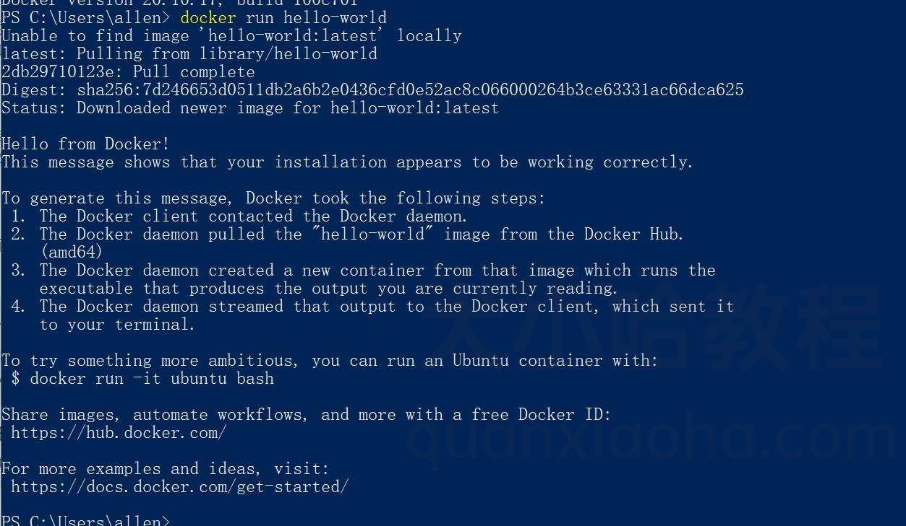
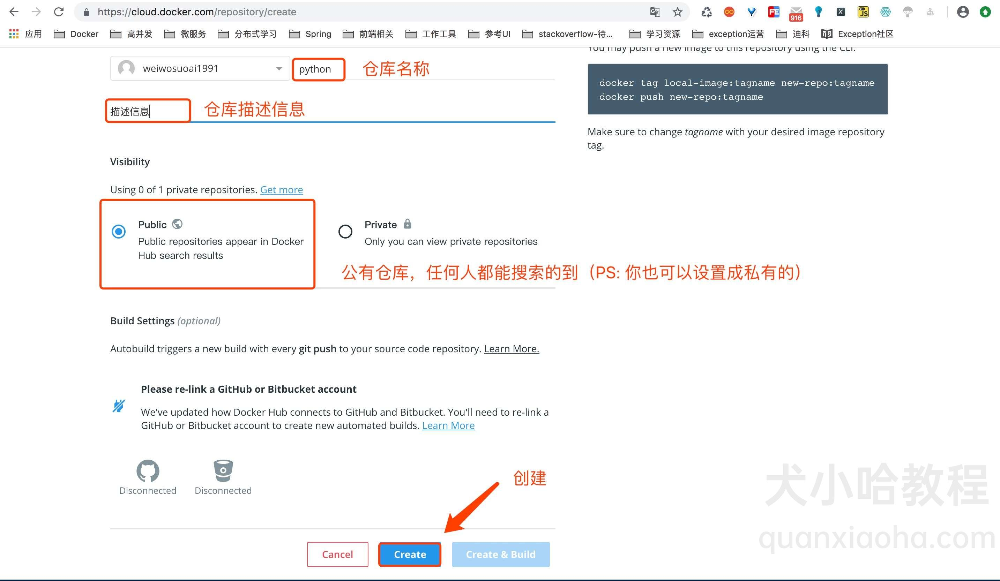
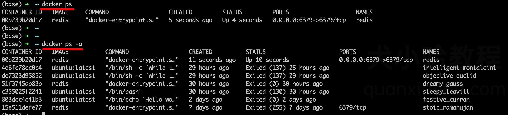
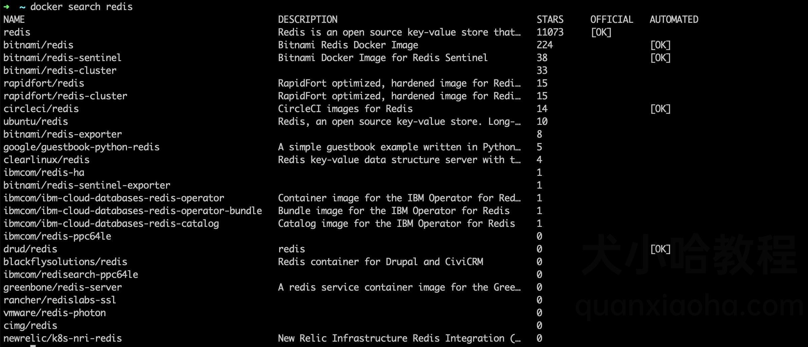

# Docker 介绍

## Docker 是什么？

**轻量级的虚拟化技术**。**Docker 可以让开发者在构建应用时，将应用与其依赖的环境一起打包到一个可移植的容器中**，然后很方便地发布到任意操作系统中。倘若，测试人员面向的是整个打包好的容器进行测试，那么，上述提到的问题将不会发生。

Docker 主要由以下部分组成：

- Docker Client；

- Docker Daemon；

- Docker Registry。

  

### Docker Client

通过后面的章节学习，我们在安装好 Docker 后，可以通过在命令窗口中敲 `docker` 命令，来执行相关操作，如 `docker run` 等。这个操作就是通过 Docker Client 客户端来执行的。

Docker Client 用于和 Docker Daemon 交互。

### Docker Daemon

Docker Daemon 是一个 Docker 后台运行的守护进程，我们的 Docker Client 的命令就是和 Docker Daemon 来进行交互的。

启动 Docker daemon 可以通过如下命令：

```
service docker start
```

或：

```
systemctl start docker.service
```

启动成功后，通过 `ps`命令即可看到 docker daemon 进程：

```
$ ps aux | grep dockerd
root     10214  1.2  0.0 1014252 23768 ?       Ssl  00:58   0:00 /usr/bin/dockerd-current --add-runtime docker-runc=/usr/libexec/docker/docker-runc-current --default-runtime=docker-runc --exec-opt native.cgroupdriver=systemd --userland-proxy-path=/usr/libexec/docker/docker-proxy-current --init-path=/usr/libexec/docker/docker-init-current --seccomp-profile=/etc/docker/seccomp.json --selinux-enabled --log-driver=journald --signature-verification=false --storage-driver overlay2
```

### Docker Registry

Registry 意为**注册中心**，它是**用来存储 Docker 镜像的地方**，后续我们下载镜像都会从注册中心下载。需要注意，注册中心有很多，常见的如官方的 Docker Hub，另外，各大云厂商也提供了自己的注册中心，比如阿里云、腾讯云等，甚至你也可以搭建自己的私有注册中心。

Docker 默认使用 Docker Hub，比如我们执行 `docker pull <image-name>` 时，Docker 默认去 Docker Hub 中寻找名字为 `image-name` 的镜像。如果使用自己的 Registry 需要进行单独的配置。

### Docker Images

Docker 镜像可以理解为**存于磁盘上面可以通过特定方式执行的静态文件**，可以类比传统虚拟机中的 ISO 文件。（Docker 镜像是可以被 Docker Daemon 识别并执行的特定文件）。

### Docker Container

Container 也就是容器。

Docker 官方对容器的定义如下：

> A container is a runnable instance of an image.

翻译过来，也非常好理解：

> **容器是镜像的运行实例。**

## Docker 和虚拟机的区别是什么？

### 虚拟机

虚拟机（Virtual Machine，简称 VM）的发展，减轻了企业对硬件资源的依赖，它将一台物理设备虚拟为多个逻辑设备，每个逻辑设备可运行不同的操作系统，并且应用程序都可以在相互独立的空间内运行而互不影响，从而显著提高设备的工作效率。

然而，传统 VM 需要安装操作系统才能执行应用程序，占用系统资源过多。多数情况下，用户只需要运行简单的应用程序，采用 VM 技术操作繁琐且造成资源浪费。倘若需要迁移应用服务程序，则需迁移整个 VM，因此企业迫切需要轻量级的虚拟化技术。

### Docker

Docker 是一种轻量级的虚拟化技术，目的和虚拟机一样，都是为了创造“隔离环境”。但是它不像 VM 采用操作系统级的资源隔离，容器采用的是进程级的系统隔离。

Docker 作为创建容器的主流工具，近年来迅速发展，它的优势在于可以让开发者将企业需要的各种应用及应用依赖文件封装在 Docker 镜像文件中，然后在任何物理设备（Linux 设备或 Window 设备等）上安装运行实现虚拟化，让应用程序彻底脱离底层设备，可以在物理机之间灵活迁移部署，使运维工程师摆脱了繁琐的环境部署，极大的提高了工作效率，同时减少了部署过程中的潜在风险。

Docker 容器具有以下三大特点：

- 轻量化：一台主机上运行的多个 Docker 容器可以共享主机操作系统内核；启动迅速，只需占用很少的计算和内存资源。
- 标准开放：Docker 容器基于开放式标准，能够在所有主流 Linux 版本、Microsoft Windows 以及包括 VM、裸机服务器和云在内的任何基础设施上运行。
- 安全可靠：Docker 赋予应用的隔离性不仅限于彼此隔离，还独立于底层的基础设施。Docker 默认提供最强的隔离，因此应用出现问题，也只是单个容器的问题，而不会波及到整台主机。

### Docker VS 虚拟机 (VM)

Docker 容器和传统 VM 虚拟化技术，在技术实现上有所不同。传统虚拟机技术是虚拟出一套硬件后，在其上运行一个完整操作系统，在该系统上再运行所需应用进程；而容器内的应用进程直接运行于宿主的内核，容器内没有自己的内核，而且也没有进行硬件虚拟。因此容器要比传统虚拟机更为轻便。

#### 表格对比更直观

以下表格可直观了解 Docker 容器与传统 VM 方式的区别：

| 对比项                             | Docker 容器                                                  | 虚拟机                                                       |
| ---------------------------------- | ------------------------------------------------------------ | ------------------------------------------------------------ |
| 隔离性                             | 较弱的隔离                                                   | 强隔离                                                       |
| 启动速度                           | 秒级                                                         | 分钟级                                                       |
| 镜像大小                           | 一般为 `MB`                                                  | 一般为 `GB`                                                  |
| 运行性能（与直接部署在机器上比较） | 接近原生（损耗小于 2%）                                      | 损耗小于 15%                                                 |
| 镜像可移植性                       | 平台无关                                                     | 平台相关                                                     |
| 系统支持量                         | 单机上支持上千个容器                                         | 一般几十个                                                   |
| 安全性                             | 1. 容器内的用户从普通用户权限提升为 `root` 权限，就直接具备了宿主机的 `root` 权限。 2. 容器中没有硬件隔离，使得容器容易受到攻击。 | 1. 虚拟机租户 `root` 权限和主机的 `root` 虚拟机权限是分离的。 2. 硬件隔离技术：防止虚拟机突破和宿主机交互。 |

## k8s 和 Docker 的区别是什么？

```
简单来说, k8s 和 Docker 并不是一个维度的东西，不具有可比性。它们之间是相互依存的关系，Docker 是容器引擎，而 k8s 是用来编排 Docker 等容器的协调器。
```


### 什么是 k8s ？

**k8s 是 Kubernetes 的缩写**, 这个单词来自于希腊语，含义是 **舵手** 或 **领航员**，**是一个可以基于容器的集群管理平台。**

k8s 由 Google 开发，它的前身是 Google 自己倒腾了十多年的 Borg 系统，在 2014 年 6 月由 Google 公司正式公布出来并宣布开源。

Google 利用在容器管理多年的经验和专业知识推出了 k8s，主要用于自动化部署应用程序容器，可以支持众多容器化工具包括现在非常流行的 Docker。

目前 k8s 是容器编排市场的领导者，开源并公布了一系列标准化方法，主流的公有云平台都宣布支持。

### K8S 解决了哪些痛点？

随着公司大小业务使用 Docker 越来越多，随之而来，也出现了一系列问题：

- 1、如何**协调、调度和管理**这些容器？
- 2、如何在升级应用程序时 **不中断服务**？
- 3、如何 **监视** 应用程序的运行状况？
- 4、如何**批量重新启动容器**里的程序？
- 5、**负载均衡**
- 6、**鉴权**和**安全性**问题
- 7、**服务之间通信**问题
- 8、**多平台部署**
- ...

于是乎，k8s 出现了，它能够很好的解决这些问题。

### 生产实践中，关于 k8s 的相关疑问

- 1、使用了 Docker, 一定要上 k8s 吗？

**非必须，得结合实际业务综合考量，** 如果是一家小型公司，本身业务并不复杂，没有那么大的用户量，是可以直接仅使用 Docker 的。相反，如果是类似阿里这种用户量大，业务复杂，需要服务器集群，那么上 k8s 就很有必要了。

- 2、没有用到 Docker, 可以使用 k8s 吗？

可以，要知道 k8s 只是一个容器编排工具，需要和容器搭配使用。而目前最流行的容器技术就是 Docker, 所以通常将它们放在一起来说，但是也可以使用其他的容器，如 RunC、Containerted 等。

# Docker 基本概念

Docker 有三大基本概念，分别是镜像（Image）、容器（Container）和仓库（Repository）。**镜像是 Docker 容器运行的前提，仓库是存放镜像的场所。**

## Docker 镜像 

在谈及 Docker 镜像之前，需知道操作系统分为 **内核** 和 **用户空间**。对于 `Linux` 而言，内核启动后，会挂载 `root` 文件系统为其提供用户空间支持。而 **Docker 镜像**（`Image`），就相当于是一个 `root` 文件系统。比如官方镜像 `ubuntu:18.04` 就包含了完整的一套 Ubuntu 18.04 最小系统的 `root` 文件系统。

**Docker 镜像是一个特殊的文件系统**，除了提供容器运行时所需的程序、库、资源、配置等文件外，还包含了一些为运行时准备的一些配置参数（如匿名卷、环境变量、用户等）。镜像不包含任何动态数据，其内容在构建之后也不会被改变。

## Docker 容器

**通过镜像运行的实例称之为容器**，两者的关系就像是面向对象程序设计中的 `类` 和 `实例` 一样，镜像是静态的定义，容器是镜像运行时的实体。容器可以被创建、启动、停止、删除、暂停等。

Docker 利用容器来运行应用，每个容器都是相互隔离的、保证安全的平台。我们可以把容器看做是一个轻量级的Linux 运行环境。

容器的实质是进程，但与直接在宿主执行的进程不同，容器进程运行于属于自己的独立的命名空间。因此容器可以拥有自己的 `root` 文件系统、自己的网络配置、自己的进程空间，甚至自己的用户 ID 空间。容器内的进程是运行在一个隔离的环境里，使用起来，就好像是在一个独立于宿主的系统下操作一样。这种特性使得容器封装的应用比直接在宿主运行更加安全。也因为这种隔离的特性，很多人初学 Docker 时常常会混淆容器和虚拟机。

容器存储层的生存周期和容器一样，容器消亡时，容器存储层也随之消亡。因此，任何保存于容器存储层的信息都会随容器删除而丢失。

按照 Docker 最佳实践的要求，容器不应该向其存储层内写入任何数据，容器存储层要保持无状态化。所有的文件写入操作，都应该使用**数据卷（Volume）**

 、或者 绑定宿主目录，在这些位置的读写会跳过容器存储层，直接对宿主（或网络存储）发生读写，其性能和稳定性更高。

数据卷的生存周期独立于容器，容器消亡，数据卷不会消亡。因此，使用数据卷后，容器删除或者重新运行之后，数据却不会丢失。

## Docker 仓库

Docker Repository 用于镜像的集中存储、分发的地方。有了它，镜像在构建完成后，在其他机器上就可以非常方便的下载使用这个镜像了。

一个 **Docker Registry** 中可以包含多个 **仓库**（`Repository`）；每个仓库可以包含多个 **标签**（`Tag`）；每个标签对应一个镜像。

通常，一个仓库会包含同一个软件不同版本的镜像，而标签就常用于对应该软件的各个版本。我们可以通过 `<仓库名>:<标签>` 的格式来指定具体是这个软件哪个版本的镜像。如果不给出标签，将以 `latest` 作为默认标签，表示最新的一个版本。

以 Ubuntu 镜像为例，`ubuntu` 是仓库的名字，其内包含有不同的版本标签，如，`16.04`, `18.04`。我们可以通过 `ubuntu:16.04`，或者 `ubuntu:18.04` 来具体指定所需哪个版本的镜像。如果忽略了标签，比如 `ubuntu`，那将视为 `ubuntu:latest`。

仓库名经常以 *两段式路径* 形式出现，比如 `jwilder/nginx-proxy`，前者往往意味着 Docker Registry 多用户环境下的用户名，后者则往往是对应的软件名。但这并非绝对，取决于所使用的具体 Docker Registry 的软件或服务。

### 公有仓库

公有仓库是允许用户免费上传、下载的公开镜像服务。比如官方的 [Docker Hub](https://hub.docker.com/) ，也是默认的 Docker Repository，里面拥有着大量的高质量镜像。

### 私有仓库

除了公有仓库外，用户还可以在本地搭建私有仓库。Docker 官方提供了 [Docker Registry](https://hub.docker.com/_/registry/) 镜像，可以直接使用做为私有 Registry 服务。

开源的 Docker Registry 镜像只提供了 [Docker Registry API](https://docs.docker.com/registry/spec/api/) 的服务端实现，足以支持 `docker` 命令，不影响使用。但不包含图形界面，以及镜像维护、用户管理、访问控制等高级功能。

除了官方的 Docker Registry 外，还有第三方软件实现了 Docker Registry API，甚至提供了用户界面以及一些高级功能。比如，Harbor 和 Sonatype Nexus。

# Docker 环境安装

## Windows 安装 Docker

### 先安装 WSL 2

#### 什么是 WSL 2 ？

WSL 是 "Windows Subsystem for Linux" 的缩写，顾名思义，WSL 就是 Windows 系统的 Linux 子系统，其作为Windows 组件搭载在 Windows 10 周年更新（1607）后的 Windows 系统中。

WSL 2 是 WSL 1 的升级版本，是适用于 Linux 的 Windows 子系统体系结构的一个新版本，它支持适用于 Linux 的 Windows 子系统在 Windows 上运行 ELF64 Linux 二进制文件。 它的主要目标是**提高文件系统性能**，以及添加**完全的系统调用兼容性**。

#### 系统要求

想要安装 WSL 2 ，系统最低要求 Windows 10 系统

- 对于 x64 系统：版本 1903 或更高版本，内部版本为 18362 或更高版本。
- 对于 ARM64 系统：版本 2004 或更高版本，内部版本为 19041 或更高版本。

或 Windows 11。

#### 启用虚拟机功能

安装 WSL 2 之前，必须启用“虚拟化”可选功能，**以管理员身份打开 PowerShell 并运行**：

```powershell
dism.exe /online /enable-feature /featurename:VirtualMachinePlatform /all /norestart
```

**重新启动**系统，以完成 WSL 安装并更新到 WSL 2。

安装成功后，打开任务管理器即可看到虚拟化已启用：


#### 安装 Docker Desktop

1、访问 Docker Desktop 官方下载地址：https://www.docker.com/products/docker-desktop/ ， 选择对应平台的 Docker Desktop 安装包点击下载：


2、下载成功后，双击开始安装：


3、安装之前的相关配置：

- Use WSL 2 instead of Hyper-V (recommended) : 启用虚拟化，以 WSL 2 替代 Hyper-V;
- Add shortcut to desktop : 安装成功后添加桌面快捷启动图标；

**将两个选项都勾选上**，然后点击【ok】,开始安装：


4、 安装成功后，点击【Close and restart】按钮重启系统：


5、重启系统成功后，会自动显示如下弹框，点击【Accept】按钮接受协议：


6、Docker 启动成功后，跳过引导介绍，看到下面界面表示 Docker 运行成功了：


#### 安装过程中你可能遇到的问题

在 Docker Desktop 启动过程中，报错如下，导致启动失败：


##### 解决方案

**通过管理员权限运行 PowerShell**, 执行如下命令：

```
netsh winsock reset
```

重启计算机，即可正常启动 Docker Desktop 。

##### 查看当前 Docker 版本

在 PowerShell 中执行如下命令，可打印 Docker 版本号：

```
docker -v
```


​																				`查看当前 Docker 版本号`

##### 验证 Docker Desktop 桌面版是否能够正常使用

在 PowerShell 中执行如下命令：

```
docker run hello-world
```

若输出如下，则表示 Docker 安装成功，且能够正常工作：



打开 Docker Desktop 可查看到刚刚的 `hello-world` 镜像：


## Ubuntu 安装 Docker

### 前置条件

#### 操作系统要求

Docker 支持以下版本的 Ubuntu `64` 位操作系统：

- Ubuntu Jammy 22.04 (LTS)
- Ubuntu Impish 21.10
- Ubuntu Focal 20.04 (LTS)
- Ubuntu Bionic 18.04 (LTS)

CPU 架构要求：`x86_64` (或 `amd64`), `armhf`, `arm64`, 和 `s390x` 均支持 Docker 安装。

#### 卸载旧版本

如果你之前安装过老版本的 Docker , 请先执行如下面命令卸载：

```
sudo apt-get remove docker docker-engine docker.io containerd runc
```

### 开始安装 Docker

Ubuntu 支持如下几种方法安装 Docker:

1. 通过 `apt` 安装，后续升级更方便（推荐方法）；
2. 手动下载 `.deb` 包安装，完全手动管理升级；
3. 使用脚本自动安装 Docker, 适用于测试、开发环境中；

#### 1. 使用 APT 安装（推荐方式）

1. 更新 `apt` 包索引：

```
sudo apt-get update
```

1. 由于 `apt` 源使用 HTTPS 以确保软件下载过程中不被篡改。因此，我们需要添加使用 HTTPS 传输的软件包以及 CA 证书。

```
sudo sudo apt install ca-certificates curl gnupg lsb-release
```

1. 为了确认所下载软件包的合法性，需要添加 Docker 的 GPG 密钥，为了确保下载速度，走的国内源，注释的为国外源：

```javascript
 sudo mkdir -p /etc/apt/keyrings
 curl -fsSL https://download.docker.com/linux/ubuntu/gpg | sudo gpg --dearmor -o /etc/apt/keyrings/docker.gpg
 sudo chmod a+r /etc/apt/keyrings/docker.gpg
```

1. 向 `sources.list` 中添加 Docker 软件源:

```
echo "deb [arch=$(dpkg --print-architecture) signed-by=/etc/apt/keyrings/docker.gpg] https://download.docker.com/linux/ubuntu $(lsb_release -cs) stable" | sudo tee /etc/apt/sources.list.d/docker.list > /dev/null
```

##### 安装 Docker

更新 apt 软件包索引，安装最新版本的 Docker Engine、containerd 和 Docker Compose：

```
 sudo apt-get update
 sudo apt-get install docker-ce docker-ce-cli containerd.io docker-compose-plugin
```

> 注意： 运行 `apt-get update` 报 GPG 错误？
>
>  你默认的 umask 可能设置不正确，导致无法检测到 repo 的公钥文件。运行以下命令，然后再次尝试更新 apt 索引：`sudo chmod a+r /etc/apt/keyrings/docker.gpg`.

##### 如何安装指定版本的 Docker ?

1. 要想安装特定版本的 Docker, 需要先获取 repo 中可用的版本号，然后再安装：

```javascript
apt-cache madison docker-ce

docker-ce | 5:20.10.16~3-0~ubuntu-jammy | https://download.docker.com/linux/ubuntu jammy/stable amd64 Packages
docker-ce | 5:20.10.15~3-0~ubuntu-jammy | https://download.docker.com/linux/ubuntu jammy/stable amd64 Packages
docker-ce | 5:20.10.14~3-0~ubuntu-jammy | https://download.docker.com/linux/ubuntu jammy/stable amd64 Packages
docker-ce | 5:20.10.13~3-0~ubuntu-jammy | https://download.docker.com/linux/ubuntu jammy/stable amd64 Packages
```

2. 第二列中显示的即为版本号，如`5:20.10.16~3-0~ubuntu-jammy`.

```
sudo apt-get install docker-ce=<VERSION_STRING> docker-ce-cli=<VERSION_STRING> containerd.io docker-compose-plugin
```

#### 2. 通过 `.deb` 包手动安装

如果你无法通过 `apt` 安装 Docker, 还可以手动下载指定版本的 `.deb` 包来安装。注意，每次升级时，同样需要下载一个新的 `.deb` 包。

1. 访问 https://download.docker.com/linux/ubuntu/dists/ ， 选择你的 Ubuntu 版本，然后进入 `pool/stable/`, 选择对应的 CPU 架构： `amd64`、 `armhf`、`arm64`或`s390x`，下载`.deb` 安装包。
2. 安装 Docker, 将下面的路径更改为你下载的 `.deb` 包路径:

```
sudo dpkg -i /path/to/package.deb
```

#### 3. 使用脚本自动安装 Docker

在测试或开发环境中， Docker 官方为了简化安装流程，提供了一套便捷的安装脚本，Ubuntu 系统上可以使用这套脚本安装，另外可以通过 `--mirror` 选项使用国内源进行安装：

```
curl -fsSL get.docker.com -o get-docker.sh
sudo sh get-docker.sh --mirror Aliyun
```

> 若你想安装测试版的 Docker, 可以从 test.docker.com 获取脚本后再执行它：
>
> ```
> $ curl -fsSL test.docker.com -o get-docker.sh
> ```

执行这个命令后，脚本就会自动的将一切准备工作做好，并且把 Docker 的稳定(stable)版本安装在 Ubuntu 系统中。

## 启动 Docker

```
# 设置 Docker 服务开机自动启动
sudo systemctl enable docker
# 启动 Docker 服务
sudo systemctl start docker
```

### 建立 Docker 用户组

默认情况下，`docker` 命令会使用 [Unix socket](https://en.wikipedia.org/wiki/Unix_domain_socket) 与 Docker 引擎通讯。只有 `root` 用户和 `docker` 组的用户才可以访问 Docker 引擎的 Unix socket。

出于安全考虑，一般 Linux 系统上不会直接使用 `root` 用户。因此，更好地做法是将需要使用 `docker` 的用户加入 `docker` 用户组。

1. 建立 `docker` 组：

```
sudo groupadd docker
```

1. 将当前用户加入 `docker` 组：

```
sudo usermod -aG docker $USER
```

退出当前终端并重新登录，进行如下测试。

### 验证 Docker 是否安装成功

运行 Docker 并打印 `hello-world`:

```
sudo docker run hello-world
```

此命令会下载测试镜像，并基于此镜像运行容器，然后在打印 `hello-world` 后退出容器。若成功打印信息，表示 Docker 安装成功。

# Docker 镜像

## Docker 搜索镜像

### 一、`search` 命令

在 Docker 中，通过如下命令搜索镜像：

```bash
docker search [option] keyword
```

比如，你想搜索仓库中 `mysql` 相关的镜像，可以输入如下命令：

```bash
docker search mysql
```


返回字段说明：

- **NAME** : 镜像名称；

- **DESCRIPTION** : 镜像描述信息；

- **STARS** : 用户标星数；

- **OFFICIAL**: 是否为官方提供，`[OK]`表示为官方提供；

  ### 二、`search` 命令支持的参数

  命令行执行 `docker search --help`, 可以知道 `search` 命令支持的参数：

  ```bash
  Usage:  docker search [OPTIONS] TERM
  
  Search the Docker Hub for images
  
  Options:
    -f, --filter filter   Filter output based on conditions provided
        --help            Print usage
        --limit int       Max number of search results (default 25)
        --no-index        Don't truncate output
        --no-trunc        Don't truncate output
  ```

  参数说明：

  - `-f, --filter filter`: 过滤输出的内容；
  - `--limit int`：指定搜索内容展示个数;
  - `--no-index`: 不截断输出内容；
  - `--no-trunc`：不截断输出内容；

举个例子，比如想搜索 Stars 数超过 100 的 mysql 镜像：

```bash
docker search --filter=stars=100 mysql
```

## Docker 拉取&下载镜像

可以通过 `pull` 命令下载镜像, 命令如下：

```bash
docker pull [IMAGE_NAME]:[TAG]
```

参数说明：

- `IMAGE_NAME`: 表示想要下载的镜像名称；
- `TAG`: 镜像的标签, 通常是镜像的版本号;

总结一下：我们需要通过 “**镜像 + 标签**” 的方式来下载镜像。

> 注意：您也可以不显式地指定 TAG, 它会默认下载 latest 标签，也就是下载仓库中最新版本的镜像。这里并不推荐您下载 latest 标签，因为该镜像的内容会跟踪镜像的最新版本，并随之变化，所以它是不稳定的。在生产环境中，可能会出现莫名其妙的 bug, 推荐您最好还是显示的指定具体的 TAG。

实践一下，假设想要下载一个 Mysql 5.7 镜像，可以通过下面命令来下载：

```bash
docker pull mysql:5.7
```

会看到控制台输出内容如下：


当有 **Downloaded** 字符串输出的时候，说明下载成功了！！

> 注意：由于官方 DockerHub 仓库服务器在国外，下载速度较慢，你需要配置国内的镜像加速器，配置教程点击下方链接：
>
> https://www.quanxiaoha.com/docker/aliyun-docker-registry.html

### 验证镜像是否下载成功

运行如下命令：

```bash
docker images
```


可以看到本地已经有了 `mysql:5.7` 的镜像，确实是下载成功了！

### `PULL` 参数说明

命令行中输入：

```bash
docker pull --help
```

可以获取 `pull` 命令支持的参数：

```bash
[root@iZbp1j8y1bab0djl9gdp33Z ~]# docker pull --help

Usage:  docker pull [OPTIONS] NAME[:TAG|@DIGEST]

Pull an image or a repository from a registry

Options:
  -a, --all-tags                Download all tagged images in the repository
      --disable-content-trust   Skip image verification (default true)
      --help                    Print usage
```

参数说明：

1. `-a, --all-tags=true|false`: 是否获取仓库中所有镜像，默认为否；
2. `--disable-content-trust`: 跳过镜像内容的校验，默认为 true;

## Docker 查看镜像信息

### 一、`images` 命令列出镜像

通过使用如下两个命令，可以列出本地已下载的镜像：

```bash
docker images
```

或：

```bash
docker image ls
```

如下图所示：


红色标注的字段说明：

- **REPOSITORY**: 来自于哪个仓库；
- **TAG**: 镜像的标签信息，比如 5.7、latest 表示镜像不同的版本；
- **IMAGE ID**: 镜像的 ID, 如果您看到两个 ID 完全相同，那么实际上，它们指向的是同一个镜像，只是标签名称不同罢了；
- **CREATED**: 镜像创建于什么时间；
- **SIZE**: 镜像的大小，优秀的镜像一般体积都比较小，小哈更倾向于轻量级的 alpine 版本镜像；

### 二、使用 inspect 命令查看镜像详细信息

通过 `docker inspect` 命令，可以获取镜像的更多详细信息，其中，包括创建者，各层 `layer` 的数字摘要等。

```bash
docker inspect mysql:5.7
```


`docker inspect` 返回的是 `JSON` 格式的信息，如果您想获取其中指定的一项内容，可以通过 `-f` 来指定，如获取镜像大小：

```bash
docker inspect -f {{".Size"}} mysql:5.7
```


### 三、使用 `history` 命令查看镜像历史

一个镜像是由多个层（layer）组成的，那么，我们要如何知道各个层的具体内容呢？

通过 `docker history` 命令，可以列出各个层（layer）的创建信息，以下是查看 `mysql:5.7` 的各层信息的命令：

```bash
docker history mysql:5.7
```


上面的输出信息中，为了美观，超出的都省略了，如果想要看具体信息，可以添加 `--no-trunc` 参数，命令如下：

```bash
docker history --no-trunc mysql:5.7
```

## 	Docker 导出&导入镜像

日常编码中，如果需要将自己本地的镜像分享给别人，可以将镜像导出成 tar 包，别人直接导入这个 tar 包，即可将镜像引入到本地镜像库。

### 一、导出镜像	

通过 `docker save` 命令可以导出 Docker 镜像。

举个例子，比如想导出下图中的 Redis 镜像：


​																							`docker 查看本地镜像`

执行命令如下：

```bash
docker save -o redis.tar redis:latest
```

`docker save -o redis.tar redis:latest`中，`-o`是`docker save`命令的一个选项，用于指定输出文件的名称或路径。

执行成功后，即可在当前目录看到打包好的 tar 包了：


可以看到 `redis.tar` 镜像文件已经生成。接下来，你可以复制它，分享给别人了！

### 二、导入镜像


别人拿到了这个 `tar` 包后，要如何导入到本地的镜像库呢？

可以通过 `docker load` 命令导入镜像：

```bash
docker load -i redis.tar
```

`-i`参数是用于指定输入文件的选项。在`docker load`命令中，`-i`用于指定要加载的镜像存档文件。

或者：

```bash
docker load < redis.tar
```

`<`符号用于重定向输入。在`docker load`命令中，`<`用于将一个文件的内容作为输入提供给该命令。

`docker load < redis.tar`中，`< redis.tar`将文件`redis.tar`的内容作为输入提供给`docker load`命令。

导入成功后，查看本地镜像，即可看到别人分享的镜像导入成功！

## Docker 删除镜像

### 一、通过标签删除镜像

以下两种命令均可删除镜像：

```bash
docker rmi [image]
```

或者：

```bash
docker image rm [image]
```

支持的参数如下：

- `-f, -force`: 强制删除镜像，即便有容器引用该镜像；

- `-no-prune`: 不要删除未带标签的父镜像；

  **请注意，在使用`docker rmi`删除镜像时，默认情况下会自动清理相关的未使用镜像资源。如果您不想进行自动清理，可以使用`-no-prune`选项，但请谨慎使用并了解其影响。**

  1. **磁盘空间占用：当删除一个镜像时，Docker会自动清理不再被其他镜像或容器使用的相关镜像资源，例如依赖该镜像的子镜像和未被其他容器使用的中间镜像层。这样可以释放磁盘空间并减少不必要的占用。禁用自动清理会导致这些未使用的镜像资源保留在磁盘上，增加磁盘空间的占用。**
  2. **镜像仓库整洁度：自动清理功能有助于保持镜像仓库的整洁。通过删除未使用的镜像资源，可以减少不必要的镜像层和依赖关系，使镜像仓库更易于管理。禁用自动清理会导致未使用的镜像资源积累，并可能使镜像仓库变得混乱和难以管理。**
  3. **存在依赖关系的镜像问题：如果禁用自动清理并删除了一个有子镜像依赖的父镜像，这些子镜像可能无法正常工作或访问所依赖的父镜像。这可能会导致容器启动失败或功能异常。**


假设，我们想删除创建的 `redis` 镜像，命令如下：

```bash
docker rmi redis:latest
```

> PS： 当有多个同名镜像存在时，想要删除指定镜像需带上 TAG。

### 二、通过 ID 删除镜像

除了通过标签名称来删除镜像，还可以通过镜像 ID 来删除镜像。


​																							`查看 Docker 镜像的 ID`

直接通过 ID 删除镜像，命令如下：

```bash
docker rmi ee7cbd482336
```

### 三、清理镜像

在使用 Docker 一段时间后，系统一般都会残存一些临时的、没有被使用的镜像文件，可以通过以下命令进行清理：

```bash
docker image prune
```

它支持的子命令有：

- `-a, --all`: 删除所有没有用的镜像，而不仅仅是临时文件；
- `-f, --force`：强制删除镜像文件，无需弹出提示确认；

另外，执行完 `docker image prune` 命令后，还会告诉我们释放了多少存储空间！

## Docker 上传镜像

### 获取 Docker ID

首先，我们需要注册 [Docker Hub](https://hub.docker.com/) 账号。打开 Docker Hub 网址 [https://hub.docker.com](https://hub.docker.com/) ，注册账号。

### 创建镜像仓库

登录成功后，会出现如下页面：


选择创建一个镜像仓库：



填写**仓库名称**、**描述信息**、**是否公开后**，点击创建。


我们看到，仓库已经创建成功了，但是里面还没有任何镜像，接下来开始上传镜像，到此新创建的仓库中。

### 上传镜像

进入命令行，**用我们刚刚获取的 Docker ID 以及密码登录**，执行命令：

```
docker login
```


登录成功后，我们开始准备上传本地的 `python:3` 镜像：


首先，我们对其打一个新的标签，**前缀与我们新创建的 Docker ID 、仓库名保持一致**:

对**python**:3复制一份一个名为**weiwosuoai1991/python**，版本为**3**的镜像

```cmd
docker tag python:3 weiwosuoai1991/python:3
```


查看本地信息，可以看到，标签打成功了。接下开，开始上传！执行命令：

```bash
docker push weiwosuoai1991/python:3
```


上传成功！去 Docker Hub 官网，新创建的仓库的信息页面验证一下，是否真的成功了：


# Docker 容器

## Docker 启动容器

Docker 启动容器有两种方式：

1. 基于镜像新建一个容器并启动；
2. 将处于终止状态 （`exited`）的容器重新启动；

### 一、基于镜像新建容器并启动

通过如下命令来启动容器：

```
docker run IMAGE:TAG
```

参数说明：

- `IMAGE`: 镜像名称；
- `TAG`: 标签，镜像版本号；
- 可以通过`--name`指定生成的容器名

举个例子，比如想启动一个 `ubuntu` 容器, 并通过终端输出 `Hello world`：


执行命令如下：

```
docker run ubuntu:latest /bin/echo 'Hello world'
```


注意，上面这行命令运行容器，在输出 `Hello world` 后就会终止运行。如果想以交互的方式运行容器，执行如下命令：

```
docker run -t -i ubuntu:latest /bin/bash
```


参数说明：

- `-t`: 让 Docker 分配一个伪终端（pseudo-tty）并绑定到容器的标准输入上;
- `-i`: `-i`选项的作用是将宿主机的标准输入（stdin）与容器的终端连接起来，实现宿主机与容器终端的交互。;

如此，就可以直接在终端执行命令了：

```bash
root@c355025f2241:/# ls
bin  boot  dev  etc  home  lib  lib32  lib64  libx32  media  mnt  opt  proc  root  run  sbin  srv  sys  tmp  usr  var
root@c355025f2241:/# date
Sun Jul  3 03:47:41 UTC 2022
```

#### 1.1 拓展知识：执行 `docker run` 后，Docker 都干了些啥？

- 检查本地是否存在指定的镜像，不存在就从 [registry](	) 下载
- 利用镜像创建并启动一个容器
- 分配一个文件系统，并在只读的镜像层外面挂载一层可读写层
- 从宿主主机配置的网桥接口中桥接一个虚拟接口到容器中去
- 从地址池配置一个 ip 地址给容器
- 执行用户指定的应用程序
- 执行完毕后容器被终止

#### 1.2 以 daemon 守护态方式运行容器

实际应用中，需要让容器以后台的方式运行，以此保证一个稳定的服务。

运行容器时添加 `-d` 参数可以让容器以后台的方式运行，例如启动一个 Ubuntu 后台容器，并每隔一秒打印 `Hello world`，命令如下:

```
docker run -d ubuntu:latest /bin/sh -c "while true; do echo hello world; sleep 1; done"
```

执行成功后，会返回一个容器 ID。


后台运行的容器可以通过 `docker logs` 命令来查看日志：

```bash
docker container logs [container ID or NAMES]
```

### 二、启动终止状态的容器

执行如下命令，可以将已经终止 （`exited`）运行的容器重启。

```
docker container start [container ID or NAMES]
```

测试一波好不好使，先通过 `docker ps` 命令获取正在运行的容器:


​	

有个 Redis 容器正在运行，先拿到容器 ID 或者容器名称，执行 `docker stop` 停止它后，再执行 `docker container start` 命令重启这个 Redis 容器 :


可以看到，成功重启了一个终止状态的容器。

## Docker 查看容器

### 查看正在运行中、停止运行的容器

- `docker ps` : 查看正在运行中的容器；
- `docker ps -a` : 查看所有容器，包括运行中的、已经停止运行的容器。



返回字段说明：

- **CONTAINER ID** : 容器 ID；
- **IMAGE** : 创建容器时使用的镜像；
- **COMMAND** : 容器最后运行的命令；
- **CREATED** : 容器创建时间；
- **STATUS** : 容器状态；
- **PORTS** : 端口信息；
- **NAMES** : 容器名：和容器 ID 一样，可以标识容器的唯一性，同一台宿主机上不允许有同名容器存在，否则会冲突；

### 拓展命令

- `docker ps -l` : 查看最新创建的容器，注意，只列出最后创建的容器。
- `docker ps -n=2`: `-n=2` 指定列出最新创建的 2 个容器。

## Docker 进入容器命令

要想进入到已运行的 Docker 容器，主要有如下两种方式：

- 使用 `docker exec` 命令;
- 使用 `docker attach` 命令;

### 一、`exec` 命令（推荐）

Docker 在 1.3.X 版本后开始支持 `exec` 命令进入容器，命令如下：

```
docker exec -it [container ID or NAMES] 
```

举个例子，比如想进入到本地的 Redis 容器中：


可以通过容器 ID 或者名称进入容器：

```
docker exec -it redis /bin/bash
```


要想退出容器，只需键入 `exit` 命令回车即可：

```
(base) ➜  ~ docker exec -it redis /bin/bash
root@023d93457910:/data#
root@023d93457910:/data#
root@023d93457910:/data#
root@023d93457910:/data# exit
exit
```

> **注意：`exec` 命令和下面 `attach` 命令的区别在于，当使用 `exit` 退出容器时，不会导致容器停止。**

### 二、`attach` 命令

执行命令格式如下：

```
docker attach [container ID or NAMES] 
```

> **注意：这种方式在执行 `exit` 命令退出容器时，会导致容器停止运行。**

## Docker 停止&关闭容器

有以下两种方式关闭一个正在运行的 Docker 容器：

### 一、`stop` 优雅模式

```
docker container stop [container ID or NAMES]
# 简写模式（可省略关键字 container ）
docker stop [container ID or NAMES]
```

### 二、`kill` 强制模式

`kill` 命令强制关闭容器：

```
docker container kill [container ID or NAMES]
# 简写模式（可省略关键字 container ）
docker kill [container ID or NAMES]
```

### 对于交互形式运行的容器如何关闭？

对于**Docker 启动容器**小节中说到的交互形式运行的容器，可以通过输入 `exit` 或者 `Ctrl+d` 退出容器。

### 查看已经停止运行的容器

执行如下命令，可以看到那些已经停止运行的容器：

```
docker container ls -a
```


想要重启已经停止运行的容器，命令如下：

```
docker container start [container ID or NAMES]
```

另外，`docker container restart` 命令会将一个已经运行中的容器重新启动。

## Docker 重启容器

执行如下命令重启 Docker 容器：

```
# 不管容器是否启动，直接重启
docker restart [container ID or NAMES]
```

### `-t` 参数

`-t` : 设置关闭容器的限制时间，若超时未能关闭，则使用 `kill` 命令强制关闭，默认值为 10s，这个时间用于容器保存自己的状态。

```
# 限时 5s 关闭 redis 容器，然后重启
docker restart -t=5 redis
```

## Docker 导出&导入容器

### 一、导出容器

使用 `docker export` 命令可以导出容器，比如想导出 Redis 容器：


```
docker export 9e8d11aeef0c > redis.tar
```

将容器的文件系统导出为一个`tar`归档文件。这个命令将容器的文件系统打包并输出到名为`redis.tar`的文件中。

导出的 `tar` 包快照存于当前目录下。

### 二、导入容器快照

使用 `docker import` 命令可以将快照导入为镜像，例如：

```
cat redis.tar | docker import - test/redis:v1.0
```

这个命令通过管道(`|`)将`cat`命令的输出（`redis.tar`文件内容）作为输入传递给`docker import`命令。`-`表示将输入作为标准输入。

`test/redis:v1.0`是您为新镜像指定的名称和标签。确保替换为您想要的实际名称和标签。

导入成功后，就可以看到新生成的镜像了：


除了通过快照的方式导入容器，还可以通过指定 URL 或者某个目录来导入，例如：

```bash
docker import http://example.com/exampleimage.tgz example/imagerepo
```

## Docker 删除容器

### 一、删除容器

执行如下命令可以删除一个已经[停止运行的容器](https://www.quanxiaoha.com/docker/docker-stop-container.html) ：

```
docker container rm [container ID or NAMES]
# 简写模式（可省略关键字 container ）
docker rm [container ID or NAMES]
```

#### 强制删除容器

添加 `-f` 参数可强制删除一个正在运行的容器：

### 二、删除所有已经停止运行的容器

如何一次性删除所有已经停止的容器呢？

用 `docker container ls -a` 命令可以查看所有已经创建的包括停止运行的容器，如果数量太多要一个个删除会很麻烦，执行如下命令即可删除掉所有已经停止运行的容器：

```
docker container prune
```

# Docker 数据管理

## Docker 数据卷

### 一、什么是数据卷？

**简单来说，数据卷是一个可供一个或多个容器使用的特殊目录，用于持久化数据以及共享容器间的数据，它以正常的文件或目录的形式存在于宿主机上。** 另外，其生命周期独立于容器的生命周期，即当你删除容器时，数据卷并不会被删除。

### 二、为什么需要数据卷？

Docker 镜像由多个文件系统（只读层）叠加而成。Docker 会加载只读镜像层，并在镜像栈顶部添加一个读写层。当运行容器后，如果修改了某个已存在的文件，那么该文件将会从下面的只读层复制到上面的读写层，同时，该文件在只读层中仍然存在。**当我们删除 Docker 容器，并通过镜像重新启动容器时，之前的更改的文件将会丢失。**

那么，要如何解决数据持久化的问题呢？于是，Docker 提出了 Volume 数据卷的概念。

### 三、数据卷特性

- 数据卷可以在容器之间共享和重用；
- 对数据卷的修改会立刻生效；
- 更新数据卷不会影响镜像；
- 数据卷默认一直存在，即使容器被删除；

### 四、挂载数据卷

Docker 提供了 3 种不同的方式将数据从宿主机挂载到容器中。


#### 4.1 volume (最常用的方式)

volume : Docker 管理宿主机文件系统的一部分，默认位于 `/var/lib/docker/volumes` 目录下, 也是最常用的方式。


看上图，所有的 Docker 容器数据都保存在 `/var/lib/docker/volumes` 目录下。若容器运行时未指定数据卷， Docker 创建容器时会使用默认的匿名卷（名称为一堆很长的 ID）。

#### 4.2 bind mount（**比较常用的方式**）

意为可以存储在宿主机中的任意位置。需要注意的是，bind mount 在不同的宿主机系统时不可移植的，比如 Windows 和 Linux 的目录结构是不一样的，bind mount 所指向的 host 目录也不一样。这也是为什么 bind mount 不能出现在 Dockerfile 中的原因所在，因为这样 Dockerfile 就不可移植了。

4.3 tmpfs mount (一般不用这种方式)

tmpfs mount : 挂载存储在宿主机的内存中，而不会写入宿主机的文件系统，一般不用此种方式。

### 五、Volume 使用

#### 5.1 创建一个数据卷

执行如下命令创建数据卷：

```bash
docker volume create test-vol
```


#### 5.2 查看所有的数据卷

```
docker volume ls
```


#### 5.3 查看数据卷信息

执行如下命令，可以查看指定的数据卷信息：

```
# 查看数据卷名为 test-vol 的信息
docker volume inspect test-vol
```


#### 5.4 运行容器时挂载数据卷

数据卷 `test-vol`创建成功后，我们运行一个 Nginx 容器，并尝试挂载该数据卷，挂载命令支持两种：

1. `-v`

```
docker run -d -it --name=test-nginx -p 8011:80 -v test-vol:/usr/share/nginx/html nginx:1.13.12
```

参数说明：

- `-d` : 后台运行容器；
- `--name=test-nginx` : 指定容器名为 test-nginx;
- `-p 8011:80` : 将容器的 80 端口挂载到宿主机的 8011 端口；
- `-v test-vol:/usr/share/nginx/html` : 将 `test-vol` 数据卷挂载到容器中的 `/usr/share/nginx/html` 目录上；

2. `--mount`

```
docker run -d -it --name=test-nginx -p 8011:80 --mount source=test-vol,target=/usr/share/nginx/html nginx:1.13.12
```

参数说明：

- `--mount source=test-vol,target=/usr/share/nginx/html` : 将 `test-vol` 数据卷挂载到容器中的 `/usr/share/nginx/html` 目录上；

##### `-v` 和 `--mount` 有什么区别？

都是挂载命令，使用 `-v` 挂载时，如果宿主机上没有指定文件不会报错，会自动创建指定文件；当使用 `--mount`时，如果宿主机中没有这个文件会报错找不到指定文件，不会自动创建指定文件。

------

容器运行成功后，进入到 `/var/lib/docker/volumes` 目录下，验证数据是否挂载成功：


可以看到已经有了 `50x.html` 、 `index.html` 两个 Nginx 页面相关数据，说明数据卷挂载成功了。挂载成功后，我们不论是修改 `/var/lib/docker/volumes` 下的数据，还是进入到容器中修改 `/usr/share/nginx/html` 下的数据，都会同步修改对应的挂载目录，类似前端开发中双向绑定的作用。

下面，我们停止并删除刚刚运行的 Nginx 容器, 看看数据卷中的数据是否会跟着被删除：


可以发现数据卷相关数据都还在，表明数据卷的生命周期独立于容器。另外，若下次再创建 Nginx 容器，还可以复用这个数据卷，复用性以及扩张性都非常不错。

##### 删除数据卷

由于数据卷的生命期独立于容器，想要删除数据卷，就需要我们手动来操作, 执行命令如下：

```
docker volume rm test-vol
```

1. 如果你需要在删除容器的同时移除数据卷，请使用 `docker rm -v [container ID or NAMES] ` 命令。
2. 对于那些没有被使用的数据卷，可能会占用较多的磁盘空间，你可以通过如下命令统一删除：

```
docker volume prune
```

### 六、bind mount 使用

通过 bind mount 模式可以挂载到宿主机的任意位置，示例如下：

```
docker run -d -it --name=test-nginx -p 8011:80 -v /docker/nginx1:/usr/share/nginx/html nginx:1.13.12
```

参数说明：

- `-v /docker/nginx1:/usr/share/nginx/html` : 将宿主机中的 `/docker/nginx1` 目录挂载到容器中的 `/usr/share/nginx/html` 目录；

#### bind mount 和 volume 挂载方式的区别

当你使用 bind mount（即 `-v /path/on/host:/path/in/container`）将主机目录挂载到容器目录时，容器目录中原有的内容将被隐藏。这意味着，如果容器目录中原本有文件，它们将不再可见。

相反，当你使用 volume（即 `-v volume-name:/path/in/container`）将数据卷挂载到容器目录时，容器目录中原有的内容将被数据卷中的内容覆盖。这意味着，如果容器目录中原本有文件，它们将被数据卷中的文件覆盖。

## Docker数据卷容器

如果你有一些需要持续更新的数据需要在容器之间共享，最佳实践是创建数据卷容器。**数据卷容器，其实就是一个正常的 Docker 容器，专门用于提供数据卷供其他容器挂载的**。

**如果你在创建数据卷容器时挂载了一个主机的空目录，那么这个目录在数据卷中也会是一个空目录。你可以把数据卷理解成一个独立的文件系统，它可以在多个容器之间共享。当你需要在容器中访问数据卷中的数据时，你可以使用 `--mount` 或 `--volumes-from` 选项将数据卷挂载到容器的某个目录中。**

### 创建数据卷容器

运行一个容器，并创建一个名为 `dbdata` 的数据卷：

```bash
    docker run -d -v /dbdata --name dbdata training/postgres echo Data-only container for postgres
```

这是一个Docker命令，它用来运行一个名为`dbdata`的容器。这个容器使用了`training/postgres`镜像，并且在后台运行（`-d`选项）。`-v /dbdata`选项将Docker主机上的`/dbdata`目录挂载到容器中。最后，这个命令运行了一个`echo Data-only container for postgres`命令，它只是输出一条信息，表示这个容器只用来存储数据。


容器运行成功后，会发现该数据卷容器处于停止运行状态，这是因为数据卷容器并不需要处于运行状态，只需用于提供数据卷挂载即可。

### 挂载数据卷

`--volumes-from` 命令支持从另一个容器挂载容器中已创建好的数据卷。

```
docker run -d --volumes-from dbdata --name db1 training/postgres

docker run -d --volumes-from dbdata --name db2 training/postgres
docker ps
CONTAINER ID   IMAGE                 COMMAND              CREATED           STATUS         PORTS       NAMES
7348cb189292   training/postgres   "/docker-entrypoint.  11 seconds ago    Up 10 seconds   5432/tcp    db2
a262c79688e8   training/postgres   "/docker-entrypoint.  33 seconds ago    Up 32 seconds   5432/tcp    db1
```

还可以使用多个 `--volumes-from` 参数来从多个容器挂载多个数据卷。 也可以从其他已经挂载了数据卷的容器来挂载数据卷。

如果删除了挂载的容器（包括 dbdata、db1 和 db2），数据卷并不会被自动删除。如果想要删除一个数据卷，必须在删除最后一个还挂载着它的容器时使用 `docker rm -v` 命令来指定同时删除关联的容器。

## Docker 备份、恢复、迁移数据卷

### 备份

首先使用 `--volumes-from` 命令创建一个加载 dbdata 的容器卷容器，并将宿主机当前目录挂载到容器的 /backup 目录，命令如下：

```
$ sudo docker run --volumes-from dbdata -v $(pwd):/backup ubuntu tar cvf /backup/backup.tar /dbdata
```

`$(pwd):/backup` 表示将主机的当前目录挂载到容器的 `/backup` 目录下。如果容器中不存在 `/backup` 目录，Docker 会在容器的根目录下自动创建一个 `/backup` 目录。`$(pwd)` 这个变量，它表示当前工作目录。`ubuntu`是一个镜像。

当你使用 `--volumes-from` 选项挂载数据卷时，如果没有指定目录映射关系，Docker 会使用默认的映射关系，即将数据卷中的根目录映射到容器中的一个与数据卷名称相同的目录。

如果你希望将数据卷中的某个目录映射到容器中的某个目录，你可以在 `--volumes-from` 选项后面指定目录映射关系。例如，如果你希望将数据卷中的 `/data` 目录映射到容器中的 `/mydata` 目录，你可以使用类似于 `--volumes-from dbdata:/data:/mydata` 的选项来实现。

容器启动后，使用了 `tar` 命令来将 dbdata 数据卷备份为容器中 /backup/backup.tar 文件，因为挂载了的关系，宿主机的当前目录下也会生成 `backup.tar` 备份文件。

### 恢复/迁移

如果要恢复数据到一个容器，首先创建一个带有空数据卷的容器 dbdata2。

```
$ sudo docker run -v /dbdata --name dbdata2 ubuntu /bin/bash
```

然后创建另一个容器，挂载 dbdata2 容器卷中的数据卷，并使用 `untar` 解压备份文件到挂载的容器卷中。

```
$ sudo docker run --volumes-from dbdata2 -v $(pwd):/backup busybox tar xvf
/backup/backup.tar
```

为了查看/验证恢复的数据，可以再启动一个容器挂载同样的容器卷来查看：

```
$ sudo docker run --volumes-from dbdata2 busybox /bin/ls /dbdata
```

# Dockerfile

## Dockerfile是什么

Dockerfile 是一个被用来构建 Docker 镜像的文本文件，该文件中包含了一行行的指令（Instruction），这些指令对应着修改、安装、构建、操作的命令，每一行指令构建一层（layer），层层累积，于是有了一个完整的镜像。

说的通俗些，大家可以这样理解： Dockerfile 是一张建筑施工图纸，工人基于这张图纸，一层一层的建造起了一座高楼大厦。

### 为什么需要 Dockerfile ?

Dockfile 可以解决镜像如下问题：

#### 1、镜像透明性问题

> 通常情况下，我们下载镜像都是从 DockerHub 官方仓库拉取镜像，这些镜像都是安全可靠的。但是仓库中也有别人上传的镜像，可以说是完全的黑盒镜像了，镜像被植入了病毒都是有可能的。有了 Dockerfile 就很好的解决了这个问题, 通过它可以清楚的看到镜像每一层的构建指令，从而判断该镜像是否安全可靠。

#### 2、镜像 layer 层无法复用问题

> 镜像是由一层层的 layer 叠加而成，通过 Dockerfile 构建镜像时，如果发现本地存在可以重复利用的 layer，就不会重复下载，这样可以节省存储空间。
>
> 举个例子更容易理解🌰，比如你之前已经构建了一个基于 Centos 的，并在其上安装了 JDK 1.8 的镜像；后续，你又有了新的需求，想在之前的镜像基础上，再安装一个 Tomcat， 那么在通过 Dockfile 构建镜像时，前面的 Centos 和 JDK 1.8 层都是可以被复用的。

#### 3、镜像维护与分享问题

> 通过 Dockerfile 构建、定制的镜像也更易于被维护与分享，如果需要新的定制，直接改 Dockerfile 重新构建就好啦~

## Dockerfile 制作构建镜像

本小节中，我们将上手通过 Dockerfile 制作第一个镜像，此镜像也非常简单，即定制一个 Nginx 镜像，唯一不同的是，我们需要将 Nginx 默认的首页欢迎语更改为 `Hello, Nginx by Docker!`。

### 开始制作镜像

新建一个空白目录，创建一个名为 `Dockerfile` 的文本文件：

```
$ mkdir mynginx
$ cd mynginx
$ touch Dockerfile
```

编辑 `Dockerfile`，添加如下指令：

```
FROM nginx
RUN echo '<h1>Hello, Nginx by Docker!</h1>' > /usr/share/nginx/html/index.html
```

这个 `Dockerfile` 非常简单，总共也就运用了两条指令：`FROM` 和 `RUN` 。

### FROM 指定基础镜像

制作镜像必须要先声明一个基础镜像，基于基础镜像，才能在上层做定制化操作。

通过 **`FROM`指令可以指定基础镜像**，在 Dockerfile 中，`FROM` 是必备指令，且必须是第一条指令。比如，上面编写的 Dockerfile 文件第一行就是 `FROM nginx`, 表示后续操作都是基于 Ngnix 镜像之上。

#### 特殊的镜像：scratch

通常情况下，基础镜像在 DockerHub 都能找到，如：

- **中间件相关**：`nginx`、`kafka`、`mongodb`、`redis`、`tomcat` 等；
- **开发语言环境** ：`openjdk`、`python`、`golang` 等；
- **操作系统**：`centos` 、`alpine` 、`ubuntu` 等；

除了这些常用的基础镜像外，还有个比较特殊的镜像 : `scratch` 。它表示一个空白的镜像：

```
FROM scratch
...
```

以 `scratch` 为基础镜像，表示你不以任何镜像为基础。

### RUN 执行命令

`RUN` 指令用于执行终端操作的 shell 命令，另外，`RUN` 指令也是编写 Dockerfile 最常用的指令之一。它支持的格式有如下两种：

- **1、`shell` 格式**: `RUN <命令>`，这种格式好比在命令行中输入的命令一样。举个栗子，上面编写的 Dockerfile 中的 `RUN` 指令就是使用的这种格式：

```
RUN echo '<h1>Hello, Nginx by Docker!</h1>' > /usr/share/nginx/html/index.html
```

- **2、`exec` 格式**: `RUN ["可执行文件", "参数1", "参数2"]`, 这种格式好比编程中调用函数一样，指定函数名，以及传入的参数。

```
RUN ["./test.php", "dev", "offline"] 等价于 RUN ./test.php dev offline
```

#### 新手构建镜像的体积太大？太臃肿？

初学 Docker 的小伙伴往往构建出来的镜像体积非常臃肿，这是什么原因导致的？

我们知道，Dockerfile 中每一个指令都会新建一层，过多无意义的层导致很多运行时不需要的东西，都被打包进了镜像内，比如编译环境、更新的软件包等，这就导致了构建出来的镜像体积非常大。

举个例子：

```
FROM centos
RUN yum -y install wget
RUN wget -O redis.tar.gz "http://download.redis.io/releases/redis-5.0.3.tar.gz"
RUN tar -xvf redis.tar.gz
```

执行以上 Dockerfile 会创建 3 层，另外，下载的 `redis.tar.gz`也没有删除掉，可优化成下面这样：

```
FROM centos
RUN yum -y install wget \
    && wget -O redis.tar.gz "http://download.redis.io/releases/redis-5.0.3.tar.gz" \
    && tar -xvf redis.tar.gz \
    && rm redis.tar.gz
```

如上，仅仅使用了一个 `RUN` 指令，并使用 `&&` 将各个命令串联起来。之前的 3 层被简化为了 1 层，同时删除了无用的压缩包。

> Dockerfile 支持 shell 格式命令末尾添加 `\` 换行，以及行首通过 `#` 进行注释。保持良好的编写习惯，如换行、注释、缩进等，可以让 Dockerfile 更易于维护。

### 构建镜像

Dockerfile 文件编写好了以后，就可以通过它构建镜像了。接下来，我们来构建前面定制的 nginx 镜像，首先，进入到该 Dockerfile 所在的目录下，执行如下命令：

```
docker build -t nginx:test .
```

> 注意：命令的最后有个点 `.` , 很多小伙伴不注意会漏掉，`.`指定**上下文路径**，也表示在当前目录下。


构建命令执行完成后，执行 `docker images` 命令查看本地镜像是否构建成功：


镜像构建成功后，运行 Nginx 容器：

```
docker run -d -p 80:80 --name nginx nginx:test
```

容器运行成功后，访问 `localhost:80`, 可以看到首页已经被成功修改了：


### 镜像构建之上下文路径

前面的构建命令最后有一个 `.`, 它表示上下文路径，它又是个啥？

```
docker build -t nginx:test .
```

理解它之前，我们要知道 Docker 在运行时分为 Docker 引擎和客户端工具，是一种 C/S 架构。看似我们在命令收入了一行 Docker 命令，立即就执行了，背后其实是将命令提交给了客户端，然后客户端通过 API 与 Docker 引擎交互，真正干活的其实是 Docker 引擎。

话说回来，在构建镜像时，经常会需要通过 `COPY` 、`ADD` 指令将一些本地文件复制到镜像中。而刚才我们也说到了，执行 `docker build` 命令并非直接在本地构建，而是通过 Docker 引擎来完成的，那么要如何解决 Docker 引擎获取本地文件的问题呢？

于是引入了上下文的概念。构建镜像时，指定上下文路径，客户端会将路径下的所有内容打包，并上传给 Docker 引擎，这样它就可以获取构建镜像所需的一切文件了。

> 注意：上下文路径下不要放置一些无用的文件，否则会导致打包发送的体积过大，速度缓慢而导致构建失败。当然，我们也可以想编写 `.gitignore` 一样的语法写一个 `.dockerignore`, 通过它可以忽略上传一些不必要的文件给 Docker 引擎。

### `docker build` 的其他用法

#### 通过 Git repo 构建镜像

除了通过 Dockerfile 来构建镜像外，还可以直接通过 URL 构建，比如从 Git repo 中构建：

```
# $env:DOCKER_BUILDKIT=0
# export DOCKER_BUILDKIT=0

$ docker build -t hello-world https://github.com/docker-library/hello-world.git#master:amd64/hello-world

Step 1/3 : FROM scratch
 --->
Step 2/3 : COPY hello /
 ---> ac779757d46e
Step 3/3 : CMD ["/hello"]
 ---> Running in d2a513a760ed
Removing intermediate container d2a513a760ed
 ---> 038ad4142d2b
Successfully built 038ad4142d2b
```

上面的命令指定了构建所需的 Git repo, 并且声明分支为 `master`, 构建目录为 `amd64/hello-world`。运行命令后，Docker 会自行 `git clone` 这个项目，切换分支，然后进入指定目录开始构建。

#### 通过 tar 压缩包构建镜像

```
$ docker build http://server/context.tar.gz
```

如果给定的 URL 是个 `tar` 压缩包，那么 Docker 会自动下载这个压缩包，并自动解压，以其作为上下文开始构建。

#### 通过 tar 压缩包构建镜像

```
$ docker build http://server/context.tar.gz
```

如果给定的 URL 是个 `tar` 压缩包，那么 Docker 会自动下载这个压缩包，并自动解压，以其作为上下文开始构建。

#### 从标准输入中读取 Dockerfile 进行构建

```
docker build - < Dockerfile
```

或

```
cat Dockerfile | docker build -
```

标准输入模式下，如果传入的是文本文件，Docker 会将其视为 `Dockerfile`，并开始构建。需要注意的是，这种模式是没有上下文的，它无法像其他方法那样将本地文件通过 `COPY` 指令打包进镜像。

#### 从标准输入中读取上下文压缩包进行构建

```
$ docker build - < context.tar.gz
```

标准输入模式下，如果传入的是压缩文件，如 `tar.gz` 、`gzip` 、 `bzip2` 等，Docker 会解压该压缩包，并进入到里面，将里面视为上下文，然后开始构建。

## Dockerfile 常用指令汇总

想要熟练使用 **Dockerfile 制作构建镜像** ，就需要熟悉 Dockerfile 常用的一些指令，除了前面小节中提到的 `COPY` 、`ADD` 指令外，Dockerfile 还额外提供了十多个指令。下面是 Dockerfile 常用指令汇总：

### Dockerfile COPY 复制文件

**复制指令，支持从上下文目录中复制文件或者文件夹到容器里的指定路径。**

`COPY` 指令同 `RUN` 指令一样，也支持两种命令格式：

```
COPY [--chown=<user>:<group>] <源路径1>...  <目标路径>
或者
COPY [--chown=<user>:<group>] ["<源路径1>",...  "<目标路径>"]
```

参数说明：

- `[--chown=<user>:<group>]` : 可选参数，可以改变被复制文件或文件夹在容器中的所属用户和所属组；
- `源路径` : 源文件或者源文件夹，支持通配符表达式，规则需要满足 Go 的 [filepath.Match](https://golang.org/pkg/path/filepath/#Match) 规则，例如：

```
COPY hom* /mydir/
COPY hom?.txt /mydir/
```

> 注意： 如果源路径为文件夹，复制的时候不是直接复制该文件夹，而是将文件夹中的内容复制到目标路径。

- `目标路径` : 复制到容器内的指定路径，无需提前创建好，路径不存在的话，会自动创建。

> 注意：目标路径可以是容器内的绝对路径，也可以是相对于工作目录的相对路径（工作目录可以用 `WORKDIR` 指令来指定）。

### Dockerfile ADD 复制文件

`ADD` 指令与 `COPY` 指令功能类似，都可以复制文件或文件夹（同样的需求下，官方推荐使用 `COPY` 指令）。格式同样支持两种：

```
ADD [--chown=<user>:<group>] <源路径1>...  <目标路径>
或者
ADD [--chown=<user>:<group>] ["<源路径1>",...  "<目标路径>"]
```

不同的是 ， `ADD` 指令在 `COPY` 的基础之上加了一些功能：

- 1、比如 `<源路径>` 可以是一个 URL, 这种情况下，Docker 引擎会去下载 URL 对应的文件并放到 `<目标路径>` 下。
- 2、如果 `<源路径>` 是一个压缩文件，如 `tar` 、`gzip` 、 `bzip2` 、`xz` 等， `ADD` 指令将自动解压此文件到 `<目标路径>` 下。

```
FROM scratch
ADD ubuntu-xenial-core-cloudimg-amd64-root.tar.gz /
...
```

#### 最佳实践

Docker 官方文档中更推荐使用 `COPY` , 因为 `COPY` 语义更加明确，乍一看就知道是复制文件，而 `ADD` 则包含了很多复杂的功能，行为不够清晰。另外，`ADD` 指令会让构建缓存失效，从而会让镜像构建变得缓慢。

那么，什么时候推荐使用 `ADD` 呢？

当你有自动解压缩的需求时，适合使用 `ADD` 指令。

### Dockerfile CMD 容器启动命令

**`CMD` 指令用于启动容器时，指定需要运行的程序以及参数**。使用格式与 `RUN` 指令类似：

```
CMD <shell 命令> 
CMD ["<可执行文件>", "<参数1>", "<参数2>", ...] # 官方推荐格式
CMD ["<参数1>", "<参数2>", ...]  # 此种写法在指定了 ENTRYPOINT 指令后，用 CMD 指定具体的参数。
```

官方更推荐使用第二种 `exec` 格式，此种格式在解析时会被解析成 JSON 数组，因此一定要使用双引号 `"` , 而不是单引号 `'` 。

如果你使用第一种 `shell` 格式，最终还是会转成第二种格式，实际命令会被包装成 `sh -c` 的参数进行执行，比如：

```
CMD echo $HOME
```

会被转成：

```
CMD [ "sh", "-c", "echo $HOME" ]
```

#### CMD 与 RUN 的不同点

`CMD` 与 `RUN` 指令不同点在于二者的运行时间点不同：

- `CMD` 指令在 `docker run` 时运行;
- `RUN` 是在 `docker build` 时运行；

#### 注意

如果 Dockerfile 中如果存在多个 CMD 指令，仅最后一个生效。

### Dockerfile ENTRYPOINT 入口点

`ENTRYPOINT` 的功能和 `CMD` 一样，都用于指定容器启动程序以及参数，格式如下：

```
ENTRYPOINT ["<executeable>","<param1>","<param2>",...]
```

> **注意**：如果 Dockerfile 中存在多个 ENTRYPOINT 指令，仅最后一个生效。

#### ENTRYPOINT 和 CMD 的不同之处

对于 `CMD` 指令， 执行 `docker run` 命令如果有传递参数，这些参数是可以覆盖 Dockerfile 中的`CMD` 指令参数，但是对于 `ENTRYPOINT` 来说，这些参数会被传递给 `ENTRYPOINT`，而不是覆盖。

> 如果想覆盖 Dockerfile 中 `ENTRYPOINT` 参数，需要在执行 `docker run` 命令时使用 `--entrypoint` 选项。

接下来，举例一个场景，让我们更容易理解 `ENTRYPOINT` 的应用场景：

#### ENTRYPOINT 应用场景

假设我们需要一个打印当前公网 IP 的镜像，那么可以先用 `CMD` 来实现, Dockerfile 文件如下：

```
FROM ubuntu:18.04
RUN apt-get update \
    && apt-get install -y curl \
    && rm -rf /var/lib/apt/lists/*
CMD [ "curl", "-s", "http://myip.ipip.net" ]
```

然后，执行 `docker build -t myip .` 来构建镜像，如果需要打印当前公网 IP，只需要执行：

```
$ docker run myip
当前 IP：61.148.226.66 来自：北京市 联通
```

这么看起来好像可以直接把镜像当做命令使用了，不过是命令总有参数，如果我们希望加参数呢？

比如从上面的 `CMD` 中可以看到实质的命令是 `curl`，如果我们希望显示 HTTP 头信息，就需要加上 `-i` 参数。那么我们可以直接加 `-i` 参数给 `docker run myip` 么？

```
$ docker run myip -i
```

会报如下错误：

```
docker: Error response from daemon: invalid header field value "oci runtime error: container_linux.go:247: starting container process caused \"exec: \\\"-i\\\": executable file not found in $PATH\"\n".
```

上面已经说到，`docker run` 传递的参数会替换 `CMD` 的默认值 ，因此这里的 `-i` 替换了原来的 `CMD`，而不是添加在原来的 `curl -s http://myip.ipip.net` 后面， 而 `-i` 根本不是命令，所以自然找不到报错。

那么如果希望支持 `-i` 这参数，我们就必须重新完整的输入这个命令：

```
$ docker run myip curl -s http://myip.ipip.net -i
```

这显然不是一个优雅的解决方案，这个时候 `ENTRYPOINT` 就上场了, 因为它可以传递参数，而不是覆盖。现在我们重新用 `ENTRYPOINT` 来实现这个镜像：

```
FROM ubuntu:18.04
RUN apt-get update \
    && apt-get install -y curl \
    && rm -rf /var/lib/apt/lists/*
ENTRYPOINT [ "curl", "-s", "http://myip.ipip.net" ]
```

这次我们再来尝试直接使用 `docker run myip -i`：

```
$ docker run myip
当前 IP：61.148.226.66 来自：北京市 联通

$ docker run myip -i
HTTP/1.1 200 OK
Server: nginx/1.8.0
Date: Tue, 22 Nov 2016 05:12:40 GMT
Content-Type: text/html; charset=UTF-8
Vary: Accept-Encoding
X-Powered-By: PHP/5.6.24-1~dotdeb+7.1
X-Cache: MISS from cache-2
X-Cache-Lookup: MISS from cache-2:80
X-Cache: MISS from proxy-2_6
Transfer-Encoding: chunked
Via: 1.1 cache-2:80, 1.1 proxy-2_6:8006
Connection: keep-alive

当前 IP：61.148.226.66 来自：北京市 联通
```

可以看到，这次成功了。

### Dockerfile ENV 设置环境变量

通过 `ENV` 指令设置环境变量，在后续的指令中，可以直接使用这个环境变量。

使用格式有两种：

```
ENV <key> <value>
ENV <key1>=<value1> <key2>=<value2>...
```

#### ENV 使用示例

以下示例中，先通过 `ENV` 指令定义了 `NODE_VERSION` 环境变量，在后续的 `RUN` 指令中使用到了它：

```
ENV NODE_VERSION 7.2.0

RUN curl -SLO "https://nodejs.org/dist/v$NODE_VERSION/node-v$NODE_VERSION-linux-x64.tar.xz" \
  && curl -SLO "https://nodejs.org/dist/v$NODE_VERSION/SHASUMS256.txt.asc"
```

下列指令均可以支持使用环境变量： `ADD`、`COPY`、`ENV`、`EXPOSE`、`FROM`、`LABEL`、`USER`、`WORKDIR`、`VOLUME`、`STOPSIGNAL`、`ONBUILD`、`RUN` 。

### Dockerfile ARG 构建参数

**`ARG` 指令用于指定构建参数**，与 `ENV` 功能一样，都是设置环境变量。不同点在于作用域不一样, `ARG` 声明的环境变量仅对 Dockerfile 内有效，也就是说仅对 `docker build` 的时候有效，将来容器运行的时候不会存在这些环境变量的。

使用格式如下：

```
ARG <参数名>[=<默认值>]
```

#### ARG 注意点

##### 一、脱敏数据安全问题

不要使用 `ARG` 保存密码之类的敏感信息，因为通过 `docker history` 可以看到所有数据。

##### 二、作用域问题

ARG 指令有生效范围，如果在 `FROM` 指令之前指定，那么只能用于 `FROM` 指令中。

```
ARG DOCKER_USERNAME=library

FROM ${DOCKER_USERNAME}/alpine

RUN set -x ; echo ${DOCKER_USERNAME}
```

使用上述 Dockerfile 会发现无法输出 `${DOCKER_USERNAME}` 变量的值，要想正常输出，你必须在 `FROM` 之后再次指定 `ARG` ：

```
# 只在 FROM 中生效
ARG DOCKER_USERNAME=library

FROM ${DOCKER_USERNAME}/alpine

# 要想在 FROM 之后使用，必须再次指定
ARG DOCKER_USERNAME=library

RUN set -x ; echo ${DOCKER_USERNAME}
```

对于多阶段构建，尤其要注意这个问题:

```
# 这个变量在每个 FROM 中都生效
ARG DOCKER_USERNAME=library

FROM ${DOCKER_USERNAME}/alpine

RUN set -x ; echo 1

FROM ${DOCKER_USERNAME}/alpine

RUN set -x ; echo 2
```

对于上述 Dockerfile 两个 `FROM` 指令都可以使用 `${DOCKER_USERNAME}`，对于在各个阶段中使用的变量都必须在每个阶段分别指定：

```
ARG DOCKER_USERNAME=library

FROM ${DOCKER_USERNAME}/alpine

# 在FROM 之后使用变量，必须在每个阶段分别指定
ARG DOCKER_USERNAME=library

RUN set -x ; echo ${DOCKER_USERNAME}

FROM ${DOCKER_USERNAME}/alpine

# 在FROM 之后使用变量，必须在每个阶段分别指定
ARG DOCKER_USERNAME=library

RUN set -x ; echo ${DOCKER_USERNAME}
```

### Dockerfile VOLUMN 定义匿名数据卷

`VOLUMN` 指令用于定义匿名`数据卷` 。

使用格式如下：

```
VOLUME ["<路径1>", "<路径2>"...]
VOLUME <路径>
```

举个例子：

```
VOLUMN /data
```

上面的 `/data` 目录在容器运行时会自动挂载为匿名卷，这样可以保证容器存储层不发生写操作，同时，如果用户后面忘记指定挂载，也能保证应用正常运行，从而避免因容器重启导致数据丢失。

当然，运行容器时可以通过 `-v` 覆盖这个挂载匿名数据卷的设置，比如：

```
$ docker run -d -v data:/data xxxx
```

通过这行命令，可以将 `data` 数据卷挂载到 `/data` 目录，覆盖了 Dockerfile 中 `VOLUMN /data` 这行挂载匿名数据卷的配置。

### Dockerfile EXPOSE 暴露端口

使用格式如下：

```
EXPOSE <端口1> [<端口2>...]
```

`EXPOSE` 指令用于暴露容器运行时提供服务的端口。注意，这仅仅是一个声明，容器实际运行时，并不会开启这个声明的端口。

所以`EXPOSE`实际上不是必须的，仅仅是为了给镜像使用者了解此镜像的应用程序所监听的端口。

在 Dockerfile 中写入 `EXPOSE` 指令好处如下：

- 1、帮助镜像使用者理解这个镜像服务的守护端口，以方便配置映射；
- 2、在运行时使用随机端口映射时，也就是 `docker run -P` 时，会自动随机映射 `EXPOSE` 的端口。

#### EXPOSE 与 docker run -p 有什么区别？

`docker run -p`，是映射宿主端口和容器端口，换句话说，就是将容器的对应端口服务公开给外界访问，而 `EXPOSE` 仅仅是声明容器打算使用什么端口而已，并不会自动在宿主进行端口映射。

### Dockerfile WORKDIR 指定工作目录

**`WORKDIR` 指令用于指定工作目录**，后面各层的当前目录即为 `WORKDIR` 指定的目录，如果该目录不存在，`WORKDIR` 会自动建立目录。

使用格式如下：

```
WORKDIR <工作目录路径>
```

#### 为什么需要 `WORKDIR` ?

初学者在学习 `Dockerfile` 时，会将其当作 Shell 脚本来写，比如：

```
RUN cd /app
RUN echo "hello" > world.txt
```

通过这个 `Dockerfile` 构建镜像运行后，会发现找不到 `/app/world.txt` 文件，或者内容不是 `hello` 。为什么会发生这种情况呢？因为在 Shell 中，连续两行命令执行是在同一个进程中；而在 `docker build` 构建镜像过程中，每一个 `RUN` 命令都会新建一层，执行环境是完全不同的。

```
WORKDIR /app
```

定义了 `WORKDIR /app` 后，就可以指定后面每层的工作目录了。

我们每次使用的`RUN`后的命令会在`/app`这个工作区目录下执行，最终这个/`app`会在最终创建好的镜像的根目录下。

### Dockerfile USER 指定当前用户

`USER` 指令用于指定后续命令的用户身份，注意，用户需事先建立好，否则无法切换。

使用格式如下：

```
USER <用户名>[:<用户组>]
```

示例：

```
RUN groupadd -r redis && useradd -r -g redis redis
USER redis
RUN [ "redis-server" ]
```

### Dockerfile HEALTHCHECK 健康检查

**`HEALTHCHECK` 指令用于设置 Docker 要如何判断容器状态是否正常**。Docker 1.12 版本后引入了该指令。

使用格式如下：

```
HEALTHCHECK [选项] CMD <命令> #设置检查容器健康状况的命令
HEALTHCHECK NONE #如果基础镜像有健康检查指令，使用这行可以屏蔽掉其健康检查指令
```

`HEALTHCHECK` 支持下列选项：

- `--interval=<间隔>`：两次健康检查的间隔，默认为 30 秒；
- `--timeout=<时长>`：健康检查命令运行超时时间，如果超过这个时间，本次健康检查就被视为失败，默认 30 秒；
- `--retries=<次数>`：健康检查重试次数，若指定次数依然失败，则将容器状态视为 `unhealthy`，默认 3 次。

当一个镜像指定了 `HEALTHCHECK` 后，初启动容器时，初始状态为 `starting`, 当 `HEALTHCHECK` 指令检查成功后，容器状态会变为 `healthy`，如果重试多次失败，则会变为 `unhealthy`。

> **注意：** 当 Dockerfile 中出现多个 `HEALTHCHECK` 时，只有最后一个生效。

#### 使用示例

```
FROM nginx
RUN apt-get update && apt-get install -y curl && rm -rf /var/lib/apt/lists/*
HEALTHCHECK --interval=5s --timeout=3s \
CMD curl -fs http://localhost/ || exit 1
```

上面的 Dockerfile 中，通过 `HEALTHCHECK` 指令设置了每 5 秒检查一次，超时时间为 3 秒，若 3 秒没有响应则视为失败，并且使用 `curl -fs http://localhost/ || exit 1` 作为健康检查命令。

当 `||` 左边的命令失败（返回非零状态码）时，`||` 右边的命令将被执行。如果 `||` 左边的命令成功（返回状态码为0），则不会执行 `||` 右边的命令。

`curl -fs http://localhost/ || exit 1` 表示如果 `curl` 命令失败，则执行 `exit 1` 命令。如果 `curl` 命令成功，则不会执行 `exit 1` 命令。

### Dockerfile ONBUILD 二次构建指令

`ONBUILD` 是一个延迟执行的特殊指令，它后面允许跟着其他指令，如 `RUN` 、`COPY` 等，这些指令在构建当前镜像时并不会被执行，而是当前镜像构建好了以后，后面再次构建镜像时，以此镜像为基础镜像，二次构建镜像时才会被执行。

使用格式：

```
ONBUILD <其它指令>
```

示例：

```
FROM node:slim
RUN mkdir /app
WORKDIR /app
ONBUILD COPY ./package.json /app
ONBUILD RUN [ "npm", "install" ]
ONBUILD COPY . /app/
CMD [ "npm", "start" ]
```

在二次构建时，当FROM指令执行后，ONBUILD指令后面的RUN等命令会立即执行。

### Dockerfile LABEL 为镜像添加元数据

`LABEL` 指令用于给镜像添加一些元数据 (metadata)， 数据为键值对的形式，格式如下：

```
LABEL <key>=<value> <key>=<value> <key>=<value> ...
```

比如声明镜像的作者、文档地址等：

```
LABEL org.opencontainers.image.authors="quanxiaoha"

LABEL org.opencontainers.image.documentation="https://www.quanxiaoha.com"
```

可以使用`docker inspect`命令来查看镜像或容器的详细信息，其中包括使用LABEL指令添加的元数据。例如，你可以使用`docker inspect <image>`命令来查看镜像的详细信息，其中`<image>`是镜像的名称或ID。在输出的信息中，你可以在`Config.Labels`字段中找到添加的元数据。

### Dockerfile SHELL 指令

#### shell 是什么

shell是一种命令行解释器，它提供了一个用户界面，用于访问操作系统的服务。常见的shell包括bash、sh、zsh、PowerShell等。

当你在Dockerfile中使用shell形式的RUN、CMD或ENTRYPOINT指令时，Docker会在容器中启动一个shell来执行命令。这相当于在容器中打开一个终端窗口，然后在其中输入命令。

而当你使用exec形式的参数时，Docker会直接执行指定的命令，而不会启动任何shell。这相当于直接调用操作系统的API来执行命令。

两种形式各有优缺点。使用shell形式时，你可以利用shell提供的功能，例如变量替换、通配符展开等。但是，由于需要启动一个额外的进程（即shell），所以执行速度会略慢一些。而使用exec形式时，执行速度会更快一些，但是不能使用shell提供的功能。

#### SHELL 指令

`SHELL` 指令可以指定 `RUN` 、`ENTRYPOINT`、`CMD` 指令执行的 shell 命令，Linux 中默认为 `["/bin/sh", "-c"]` 。

使用格式如下：

```
SHELL ["executable", "parameters"]
```

示例：

```
SHELL ["/bin/sh", "-cex"]

# /bin/sh -cex "nginx"
ENTRYPOINT nginx
SHELL ["/bin/sh", "-cex"]

# /bin/sh -cex "nginx"
CMD nginx
```

例如，如果你习惯使用bash shell，并且想在Dockerfile中使用bash提供的一些特定功能，你可以在Dockerfile中添加一行`SHELL ["/bin/bash", "-c"]`来指定使用bash作为默认shell。

此外，有些基础镜像可能不包含默认的shell（例如`/bin/sh`），或者包含的默认shell版本过旧。在这种情况下，你可以使用SHELL指令来指定一个可用的shell。

# Docker Compose

## Docker Compose 是什么

**`Docker Compose` 是 Docker 官方的开源项目，能够实现对 Docker 容器集群的快速编排，以保证快速部署分布式应用。**

> 知识点拓展：`compose` 和 `swarm` 是 `docker` 官方提供的容器编排工具。
>
> Docker Compose 开源地址：https://github.com/docker/compose

### Docker Compose 解决了什么问题？

在实际的生产环境中，往往需要多个容器配合工作，才能称的上一个完整的应用服务。

举个栗子，你想搭建一个 Web 服务，除了 Web 服务容器本身，若涉及数据存储，就需要依赖数据库容器（Mysql、Mongdb 等）；若想实现分词搜索，就需要依赖搜索引擎容器（Elasticsearch、Solor 等）；其他诸如缓存容器、负载均衡容器等。

同时，部署和管理繁多的容器服务是非常困难的。有了 `Docker Compose` ，就能很好的解决这个问题！`Docker Compose` 通过一个声明式的配置文件 `docker-compose.yml` 来描述整个应用，使用一条命令即可完成部署。应用部署成功后，还可以通过一系列简单的命令实现对应用生命周期的管理。甚至，配置文件还可以置于版本控制系统中进行存储和管理。

### ompose 中的核心概念

`Compose` 中有两个重要的概念：

- 服务 (`service`)：一个应用的容器，实际上可以包括若干运行相同镜像的容器实例。
- 项目 (`project`)：由一组关联的应用容器组成的一个完整业务单元，在 `docker-compose.yml` 文件中定义

## Docker Compose 安装与卸载

Docker Compose 支持如下主流操作系统的安装：

- Linux
- MacOS
- Windows 10 以及更高版本

### Windows 系统安装

Windows 系统中，如果已经成功安装 `Docker Desktop` 桌面版 , 那么 `docker-compose` 也就安装成功了，两者是打包在一起安装的，无需二次安装。

若需手动确认本地是否安装好了 Docker Compose 环境，打开命令行，输入如下命令：

```
docker-compose --version
```

若成功输出 Docker Compose 版本号，则表示环境已经安装成功了：


### Linux & MacOS 系统安装

Linux & MacOS 系统中，Docker Compose 可以通过如下两种方式来安装：

- 1、通过二进制包安装；
- 2、通过 PIP 安装；

#### 通过二进制包安装

从 [官方 GitHub Release](https://github.com/docker/compose/releases) 直接下载编译好的二进制文件即可，例如，在 Linux 64 位系统上直接下载对应的二进制包：

```bash
$ wget -0 /usr/local/bin/docker-compose https://github.com/docker/compose/releases/download/v2.18.1/docker-compose-linux-x86_64
$ sudo chmod +x /usr/local/bin/docker-compose
```

#### 通过 PIP 安装

> 注意：`x86_64` 架构的 Linux 建议按照上边的方法下载二进制包进行安装，如果您计算机的架构是 `ARM` (例如，树莓派)，再使用 `pip` 安装。

如果你的机器安装了 Python 环境，还可以将 Compose 当作一个 Python 应用来从 pip 源中安装，安装命令如下：

```bash
$ sudo pip install -U docker-compose
```

若输出类似如下信息，表明安装成功：

```bash
Collecting docker-compose
  Downloading docker-compose-1.27.4.tar.gz (149kB): 149kB downloaded
...
Successfully installed docker-compose cached-property requests texttable websocket-client docker-py dockerpty six enum34 backports.ssl-match-hostname ipaddress
```

### 卸载 Docker Compose

#### Windows 卸载

Windows 只需卸载 Docker Desktop 即可完成 Docker Compose 的卸载：


#### Linux & MacOS 卸载

如果是二进制包方式安装的，删除二进制文件即可。

```
$ sudo rm /usr/local/bin/docker-compose
```

如果是通过 `pip` 安装的，则执行如下命令即可删除。

```
$ sudo pip uninstall docker-compose
```

## Docker Compose 实战 web 服务

本小节中，我们将通过 Docker Compose 搭建一个简单的网站。

### 需求

这个简单的网站需实现功能：**每当用户访问时，后台进行计数，并在页面中显示总访问次数**。效果如下：


### 技术选型

- Web 应用：Spring Boot
- Redis 缓存（用于计数用户访问次数）

### 开始

#### web 应用

新建一个 Spring Boot 项目， 主代码如下：

```java
package com.example.dockerdemo;

import org.springframework.boot.SpringApplication;
import org.springframework.boot.autoconfigure.SpringBootApplication;
import org.springframework.data.redis.core.RedisTemplate;
import org.springframework.stereotype.Controller;
import org.springframework.web.bind.annotation.GetMapping;
import org.springframework.web.bind.annotation.ResponseBody;

@SpringBootApplication
@Controller
public class DockerDemoApplication {

    private final RedisTemplate redisTemplate;

    public static void main(String[] args) {
        SpringApplication.run(DockerDemoApplication.class, args);
    }

    public DockerDemoApplication(RedisTemplate redisTemplate) {
        this.redisTemplate = redisTemplate;
    }

    @GetMapping("/")
    @ResponseBody
    public String index() {
    	// 对 redis 里面的被访问数执行 +1 操作
        Long viewNum = redisTemplate.opsForValue().increment("view_num");
        return String.format("<h1>页面总访问次数: %s</h1>", viewNum);
    }

}
```

Spring Boot 的 `application.yml` 配置文件如下：

```yaml
spring:
  redis:
    host: redis
    port: 6379
```

#### Dockerfile

为 Spring Boot 编写 Dockerfile :

```dockerfile
# FROM 指定使用哪个镜像作为基准
FROM openjdk:8-jdk-alpine
# 数据卷
VOLUME /tmp
# 复制文件到镜像中
COPY docker-demo-0.0.1-SNAPSHOT.jar app.jar
# 指定容器内的时区
RUN echo "Asia/Shanghai" > /etc/timezone;
# ENV为设置环境变量
ENV JAVA_OPTS=""
# ENTRYPOINT 为启动时运行的命令
ENTRYPOINT ["sh", "-c", "java $JAVA_OPTS -Djava.security.egd=file:/dev/./urandom -jar /app.jar"]
```

编译打包 Spring Boot, 然后将 Dockerfile 文件放置在 `jar` 包的同级目录下，执行如下命令开始构建 `web` 镜像：

```bash
docker build -t web:test .
```

执行成功后，通过 `docker images` 可以看到构建成功的本地镜像:


#### docker-compose.yml

编写 `docker-compose.yml` 文件：

```
version: '3'
services:
  web:
    image: "web:test"
    ports:
      - "8080:8080"

  redis:
    image: "redis:latest"
```

#### 运行 compose 项目

在 `docker-compose.yml` 文件的同级目录下，执行运行命令：

```
docker-compose up
```


`compose` 项目运行成功后，访问 web 服务，可以看到访问次数 `+1` 功能成功实现：


#### ENTRYPOINT 为启动时运行的命令

在Dockerfile中，我们编辑了这样一条命令：

```bash
ENTRYPOINT ["sh", "-c", "java $JAVA_OPTS -Djava.security.egd=file:/dev/./urandom -jar /app.jar"]
```

对于这条命令的**解释**：

##### sh -c

`-c` 是 `sh` 命令的一个选项，它用于指定要在 shell 中执行的命令字符串。当你使用 `sh -c` 命令时，shell 会启动并执行指定的命令字符串，然后退出。

例如，下面的命令使用 `sh -c` 来在 shell 中执行 `ls -l /etc` 命令：

```
sh -c "ls -l /etc"
```

##### $JAVA_OPTS

`JAVA_OPTS` 是一个环境变量，它包含了一些 Java 虚拟机（JVM）的选项。这些选项可以用来调整 JVM 的性能和行为。

当你在命令行中运行 Java 程序时，可以使用 `$JAVA_OPTS` 变量来指定 JVM 选项。例如，你可以使用下面的命令来运行一个 jar 文件，并使用 `$JAVA_OPTS` 中指定的 JVM 选项：

```
java $JAVA_OPTS -jar /app.jar
```

复制

你可以通过修改 `JAVA_OPTS` 环境变量的值来改变 JVM 的配置。例如，你可以使用下面的命令来设置 `JAVA_OPTS` 的值：

```
export JAVA_OPTS="-Xms512m -Xmx1024m"
```

复制

这样，在运行 Java 程序时，JVM 将使用 `-Xms512m -Xmx1024m` 这些选项。

##### random

`-Djava.security.egd=file:/dev/./urandom`

使用 `-Djava.security.egd=file:/dev/./urandom` 选项可以加快程序的启动速度，是因为它指定了随机数生成器的种子来源为 `/dev/urandom`。`/dev/urandom` 是一个非阻塞的随机数生成器，它可以更快地生成随机数。

如果你不指定这个选项，JVM 将使用默认的种子来源来初始化随机数生成器。在某些操作系统中，例如 Linux，JVM 的默认种子来源是 `/dev/random`。`/dev/random` 是一个阻塞的随机数生成器，它需要收集足够的熵来生成随机数。如果系统中的熵不足，那么读取 `/dev/random` 时将会阻塞，直到收集到足够的熵为止。

这意味着，在某些情况下，使用默认的种子来源可能会导致程序启动缓慢。这是因为 JVM 需要等待 `/dev/random` 收集到足够的熵才能继续运行。

而使用 `-Djava.security.egd=file:/dev/./urandom` 选项可以避免这个问题。因为 `/dev/urandom` 是一个非阻塞的随机数生成器，它不需要等待熵的收集，所以可以更快地生成随机数。这样，JVM 可以更快地初始化随机数生成器，从而加快程序的启动速度。

Web 程序在启动时会初始化随机数生成器，以便在运行过程中快速地生成随机数。这些随机数可以用来支持安全相关的操作，例如生成会话 ID、安全令牌等。

例如，当用户登录到 Web 程序时，程序会为用户创建一个会话，并为该会话分配一个唯一的会话 ID。这个会话 ID 通常是由随机数生成器生成的。程序会将这个会话 ID 发送给用户的浏览器，并在后续的请求中使用它来识别用户。

因此，Web 程序中的一些内容，例如会话 ID、安全令牌等，是基于随机数生成器生成的随机数来生成的。这些随机数可以增强程序的安全性，防止攻击者预测程序的行为。

总之，通过这个参数，**Web 程序在启动时会初始化随机数生成器，以便在运行过程中快速地生成随机数。**

## Docker Compose 命令大全

### `docker-compose` 命令

**使用格式：**

```
docker-compose [-f=<arg>...] [options] [COMMAND] [ARGS...]
```

> **提示**：执行 `docker-compose [COMMAND] --help` 或者 `docker-compose help [COMMAND]` 可查看具体某个命令的使用格式。

**支持的选项：**

- `-f, --file FILE` 指定使用的 Compose 模板文件，默认为 `docker-compose.yml`，可以多次指定。
- `-p, --project-name NAME` 指定项目名称，默认将使用所在目录名称作为项目名。
- `--verbose` 输出更多调试信息。
- `-v, --version` 打印版本并退出。

### `docker-compose build` 命令

**使用格式：**

```
docker-compose build [options] [SERVICE...]
```

构建（重新构建）项目中的服务容器。

服务容器一旦构建后，将会带上一个标记名，例如对于 web 项目中的一个 db 容器，可能是 web_db。

可以随时在项目目录下运行 `docker-compose build` 来重新构建服务。

**支持的选项：**

- `--force-rm` 删除构建过程中的临时容器。
- `--no-cache` 构建镜像过程中不使用 cache（这将加长构建过程）。
- `--pull` 始终尝试通过 pull 来获取更新版本的镜像。

### `docker-compose config` 命令

验证 Compose 文件格式是否正确，若正确则显示配置，若格式错误显示错误原因。

**使用格式：**

```
docker-compose config [选项]
```

**支持的选项：**

- `-q, --quiet` 只验证配置，不输出。 当配置正确时，不输出任何内容，当文件配置错误，输出错误信息。
- `--services` 打印服务名，一行一个验证和查看compose文件配置。

### `docker-compose down` 命令

此命令将会停止 `up` 命令所启动的容器，并移除网络。

**使用格式：**

```
docker-compose down [选项]
```

**支持的选项：**

- --rmi type 删除镜像，类型必须是:

'all': 删除compose文件中定义的所以镜像。

'local': 删除镜像名为空的镜像

- -v, --volumes 删除卷
- --remove-orphans 删除Compose文件中未定义的服务。

停止和删除容器、网络、卷、镜像，这些是通过docker-compose up命令创建的. 默认值删除 容器 网络，可以通过指定 rmi volumes参数删除镜像和卷

### `docker-compose exec` 命令

进入指定的容器。

**使用格式：**

```
docker-compose exec [选项] [-e KEY=VAL...] SERVICE COMMAND [ARGS...]
```

**支持的选项：**

- `-d` 分离模式，后台运行命令.
- `--privileged` 获取特权.
- `--user USER` 指定运行的用户.
- `-T` 禁用分配TTY.`docker-compose exec`默认分配 a TTY.
- `--index=index` 当一个服务拥有多个容器时，可通过该参数登陆到该服务下的任何服务，例如：docker-compose exec --index=1 web /bin/bash ，web服务中包含多个容服务实例 [default: 1]和docker exec命令功能相同，可以通过service name登陆到容器中。

### `docker-compose help` 命令

获得一个命令的帮助信息。

### `docker-compose images` 命令

列出 Compose 文件中包含的镜像。

**使用格式：**

```
docker-compose images [选项] [SERVICE...]
```

**支持的选项：**

- `-q, --quiet` 只显示id

### `docker-compose kill` 命令

通过发送 `SIGKILL` 信号来强制停止服务容器。

**使用格式：**

```
docker-compose kill [options] [SERVICE...]
```

**支持的选项：**

- `-s SIGNAL` 支持通过 `-s` 参数来指定发送的信号，例如通过如下指令发送 `SIGINT` 信号。

```
$ docker-compose kill -s SIGINT
```

### `docker-compose logs` 命令

查看服务容器的输出。默认情况下，docker-compose 将对不同的服务输出使用不同的颜色来区分。可以通过 `--no-color` 来关闭颜色。该命令在调试问题的时候十分有用。

**使用格式：**

```
docker-compose logs [options] [SERVICE...]
```

**支持的选项：**

- `--no-color` 单色输出，不显示其他颜.
- `-f, --follow` 跟踪日志输出，就是可以实时查看日志
- `-t, --timestamps` 显示时间戳
- `--tail` 从日志的结尾显示，--tail=200，显示日志输出。

### `docker-compose pause` 命令

暂停一个正在运行的服务容器。

**使用格式：**

```
docker-compose pause [SERVICE...]
```

> 可以使用 `docker-compose unpause` 进行恢复。

### `docker-compose port` 命令

打印某个容器端口所映射的公共端口。

**使用格式：**

```
docker-compose port [options] SERVICE PRIVATE_PORT
```

**支持的选项：**

- `--protocol=proto` 指定端口协议，tcp（默认值）或者 udp。
- `--index=index` 如果同一服务存在多个容器，指定命令对象容器的序号（默认为 1）。

### `docker-compose ps` 命令

列出项目中目前的所有容器。

**使用格式：**

```
docker-compose ps [options] [SERVICE...]
```

**支持的选项：**

- `-q` 只打印容器的 ID 信息。

### `docker-compose pull` 命令

拉取服务依赖的镜像。

**使用格式：**

```
docker-compose pull [options] [SERVICE...]
```

**支持的选项：**

- `--ignore-pull-failures` 忽略拉取镜像过程中的错误。

### `docker-compose push` 命令

推送服务依赖的镜像到 Docker 镜像仓库。

**使用格式：**

```
docker-compose push [选项] [SERVICE...]
```

**支持的选项：**

- `--ignore-push-failures` 忽略错误。

### `docker-compose restart` 命令

重启项目中的服务。

**使用格式：**

```
docker-compose restart [options] [SERVICE...]
```

**支持的选项：**

- `-t, --timeout TIMEOUT` 指定重启前停止容器的超时（默认为 10 秒）。

### `docker-compose rm` 命令

删除所有（停止状态的）服务容器。推荐先执行 `docker-compose stop` 命令来停止容器。

**使用格式：**

```
docker-compose rm [options] [SERVICE...]
```

**支持的选项：**

- `-f, --force` 强制直接删除，包括非停止状态的容器。一般尽量不要使用该选项。
- `-v` 删除容器所挂载的数据卷。

### `docker-compose run` 命令

在指定服务上执行一个命令。

**使用格式：**

```
docker-compose run [options] [-p PORT...] [-e KEY=VAL...] SERVICE [COMMAND] [ARGS...]
```

例如：

```
$ docker-compose run ubuntu ping docker.com
```

将会启动一个 ubuntu 服务容器，并执行 `ping docker.com` 命令。

默认情况下，如果存在关联，则所有关联的服务将会自动被启动，除非这些服务已经在运行中。

该命令类似启动容器后运行指定的命令，相关卷、链接等等都将会按照配置自动创建。

两个不同点：

- 给定命令将会覆盖原有的自动运行命令；
- 不会自动创建端口，以避免冲突。

如果不希望自动启动关联的容器，可以使用 `--no-deps` 选项，例如

```
$ docker-compose run --no-deps web python manage.py shell
```

将不会启动 web 容器所关联的其它容器。

**支持的选项：**

- `-d` 后台运行容器。
- `--name NAME` 为容器指定一个名字。
- `--entrypoint CMD` 覆盖默认的容器启动指令。
- `-e KEY=VAL` 设置环境变量值，可多次使用选项来设置多个环境变量。
- `-u, --user=""` 指定运行容器的用户名或者 uid。
- `--no-deps` 不自动启动关联的服务容器。
- `--rm` 运行命令后自动删除容器，`d` 模式下将忽略。
- `-p, --publish=[]` 映射容器端口到本地主机。
- `--service-ports` 配置服务端口并映射到本地主机。
- `-T` 不分配伪 tty，意味着依赖 tty 的指令将无法运行。

### `docker-compose scale` 命令

设置指定服务运行的容器个数。

**使用格式：**

```
docker-compose scale [options] [SERVICE=NUM...]
```

通过 `service=num` 的参数来设置数量。例如：

```
$ docker-compose scale web=3 db=2
```

将启动 3 个容器运行 web 服务，2 个容器运行 db 服务。

一般的，当指定数目多于该服务当前实际运行容器，将新创建并启动容器；反之，将停止容器。

**支持的选项：**

- `-t, --timeout TIMEOUT` 停止容器时候的超时（默认为 10 秒）。

### `docker-compose start` 命令

启动已经存在的服务容器。

**使用格式：**

```
docker-compose start [SERVICE...]
```

### `docker-compose stop` 命令

停止已经处于运行状态的容器，但不删除它。通过 `docker-compose start` 可以再次启动这些容器。

**使用格式：**

```
docker-compose stop [options] [SERVICE...]
```

**支持的选项：**

- `-t, --timeout TIMEOUT` 停止容器时候的超时（默认为 10 秒）。

### `docker-compose top` 命令

查看各个服务容器内运行的进程。

**使用格式：**

```
docker-compose top [SERVICE...]
```

### `docker-compose unpause` 命令

恢复处于暂停状态中的服务。

使用格式：

```
docker-compose unpause [SERVICE...]
```

### `docker-compose up` 命令

该命令十分强大，它将尝试自动完成包括构建镜像，（重新）创建服务，启动服务，并关联服务相关容器的一系列操作。

链接的服务都将会被自动启动，除非已经处于运行状态。

可以说，大部分时候都可以直接通过该命令来启动一个项目。

默认情况，`docker-compose up` 启动的容器都在前台，控制台将会同时打印所有容器的输出信息，可以很方便进行调试。

当通过 `Ctrl-C` 停止命令时，所有容器将会停止。

如果使用 `docker-compose up -d`，将会在后台启动并运行所有的容器。一般推荐生产环境下使用该选项。

默认情况，如果服务容器已经存在，`docker-compose up` 将会尝试停止容器，然后重新创建（保持使用 `volumes-from` 挂载的卷），以保证新启动的服务匹配 `docker-compose.yml` 文件的最新内容。如果用户不希望容器被停止并重新创建，可以使用 `docker-compose up --no-recreate`。这样将只会启动处于停止状态的容器，而忽略已经运行的服务。如果用户只想重新部署某个服务，可以使用 `docker-compose up --no-deps -d <SERVICE_NAME>` 来重新创建服务并后台停止旧服务，启动新服务，并不会影响到其所依赖的服务。

**使用格式：**

```
docker-compose up [options] [SERVICE...]
```

**支持的选项：**

- `-d` 在后台运行服务容器。
- `--no-color` 不使用颜色来区分不同的服务的控制台输出。
- `--no-deps` 不启动服务所链接的容器。
- `--force-recreate` 强制重新创建容器，不能与 `--no-recreate` 同时使用。
- `--no-recreate` 如果容器已经存在了，则不重新创建，不能与 `--force-recreate` 同时使用。
- `--no-build` 不自动构建缺失的服务镜像。
- `-t, --timeout TIMEOUT` 停止容器时候的超时（默认为 10 秒）。

### `docker-compose version` 命令

打印版本信息。

# Docker 常见环境安装

## Docker 安装 Redis

### 一、下载 Redis 镜像

首先，执行如下命令下载 Redis 镜像:

```shell
docker pull redis
```

> 注意：未指定 Redis TAG 的情况下，默认下载最新的 `latest` 版本镜像。


#### 查找指定版本的 Redis 镜像

如果不想使用最新版本的 Redis 镜像,可以先在 [Docker Hub](https://hub.docker.com/) 中查找可用的 Redis 版本号。

Redis 镜像库访问地址：https://hub.docker.com/_/redis?tab=tags


另外，还可以通过 `docker search redis` 命令来查看可用的 Redis 镜像版本：



### 二、确认 Redis 镜像是否下载成功

执行 `docker images` 命令，确认镜像是否已经下载到本地：


### 三、运行 Redis 容器

执行如下命令运行 Redis 容器：

```shell
docker run -d --name redis -p 6379:6379 redis
```

参数说明：

- `-d`: 指定容器后台运行；
- `--name`: 指定容器名称为 redis;
- `-p 6379:6379`: 将容器的 6379 端口映射到宿主机的 6379 端口, 这样就可以直接通过访问本机的 6379 端口来访问 redis 容器了；


### 四、检查 Redis 容器是否运行成功

执行 `docker ps` 命令可以查看正在运行的 Docker 容器：


### 五、连接刚刚运行的 Redis 容器

执行如下命令连接 Redis 容器：

```
docker run -it redis redis-cli -h 172.17.0.1
```


## Docker 安装 MySQL

### 一、下载 Mysql 镜像

这里以安装 Mysql 5.7 版本为例：

```bash
docker pull mysql:5.7
```

下载完成后，通过 `docker images` 检查一下镜像是否下载成功:


### 二、启动 Mysql 容器

先以简单的方式启动：

```cmd
docker run -d \
--name mysql \
-p 3306:3306 \
-e MYSQL_ROOT_PASSWORD=123456 \
mysql:5.7
```

参数说明：

- `-d`：以后台的方式运行；
- `--name mysql`：指定容器的名称为 mysql;
- `-p 3306:3306` 将容器的 3306 端口挂载到宿主机的 3306 端口上；
- `-e MYSQL_ROOT_PASSWORD=123456`：指定 root 的密码为 123456

命令执行完成后，可以通过 `docker ps`命令来确认下容器是否启动成功。


注意，此方式启动的容器，容器重启后会丢失存储的数据，所以还需要在启动容器时，将相关目录挂载到宿主机，防止数据丢失。

针对 Mysql 容器，我们想要防丢失的目录分别包括：

- mysql 配置文件；
- 数据存储目录；

执行 `docker cp` 命令，将想挂载的目录复制到宿主机中的固定目录下：

```cmd
# 将容器中的 mysql 配置文件复制到宿主机中指定路径下，路径你可以根据需要，自行修改
docker cp mysql:/etc/mysql/mysql.conf.d/mysqld.cnf /usr/local/docker/mysql/config
# 将容器中的 mysql 存储目录复制到宿主机中
docker cp mysql:/var/lib/mysql/ /usr/local/docker/mysql/data
```

完成这一切后，让我们将刚刚运行的容器删除掉。

```cmd
docker rm -f mysql
```

> PS: mysql 是我们运行容器时指定的名称，当然，你也可以通过容器 ID 来删除容器。

### 三、正式运行 Mysql 容器

接下来，正式运行 Mysql 容器：

```bash
docker run -d \
--name mysql \
-p 3306:3306 \
-v /usr/local/docker/mysql/config/mysqld.cnf:/etc/mysql/mysql.conf.d/mysqld.cnf \
-v /usr/local/docker/mysql/data/mysql:/var/lib/mysql \
-e MYSQL_ROOT_PASSWORD=123456 \
mysql:5.7
```

其他不变，额外添加了两个挂载目录参数：

- `-v /usr/local/docker/mysql/config/mysqld.cnf:/etc/mysql/mysql.conf.d/mysqld.cnf`: 将容器中 /etc/mysql/mysql.conf.d/mysqld.cnf 配置文件挂载到宿主机的 /usr/local/docker/mysql/config/mysqld.cnf 文件上；
- `-v /usr/local/docker/mysql/data:/var/lib/mysql`: 将容器中 /var/lib/mysql 数据目录挂载到宿主机的 /usr/local/docker/mysql/data 目录下；

执行 `docker ps` 命令，查看下容器是否启动：


### 四、通过 Mysql 客户端连接一下试试

通过 MySQL 客户端连接刚刚创建的 mysql, 看看能否连接成功：


### 五、相关问题补充

#### 5.1 时区不对问题

在向数据库插入数据时，总是发现时间比系统时间少 8 个小时，这是因为 Mysql 的时区并不是我们想要的东八区。

解决方案：修改挂载到宿主机的 Mysql 配置文件 `mysqld.cnf` ，添加如下参数：

```xml
default-time-zone = '+08:00'
```

添加改配置后，重启 MySQL 容器, 再插入数据，就发现插入的数据时间正常了：

```shell
docker restart mysql
```

## Docker 安装 Nginx

### 一、下载 Nginx 镜像

```
docker pull nginx:1.19.4
```

> PS：小哈这里下载的是 1.19.4 版本 Nginx 镜像，你可以在 [Docker Hub](https://hub.docker.com/) 上查找你想要的可用版本镜像。

命令执行成功后，通过 `docker images` 命令检查一下镜像是否下载成功：


### 二、运行 Nginx 容器

```bash
docker run -d -p 80:80 --name nginx nginx:1.19.4
```

参数说明：

- `-p 80:80`: 将容器的 80 端口映射到宿主机的 80 端口上；
- `-d`: 以后台方式运行镜像；
- `--name`: 指定容器的名称为 nginx;

命令执行完成后，通过 `docker ps`命令确认一下容器是否启动成功。

Nginx 容器运行成功后，访问 `http://localhost`，即可看到 Nginx 欢迎页面：

> 提示：访问 `http://localhost` 在不指定端口的情况下，默认端口号为 80


### 三、复制 Nginx 配置文件至宿主机

因为容器重启会丢失内部数据，因此要将需要持久化的文件挂载到宿主机中，以防数据丢失。

挂载之前，复制容器中需要持久化的相关配置文件到宿主机的指定路径下：

```bash
# 复制名称为 nginx 容器中 /etc/nginx/nginx.conf 文件到宿主机的 /docker/nginx 路径下，宿主机的持久化目录根据你的需要自定义路径
docker cp nginx:/etc/nginx/nginx.conf /docker/nginx
# 复制名称为 nginx 容器中 /etc/nginx/conf.d 文件夹到宿主机的 /docker/nginx 路径下
docker cp nginx:/etc/nginx/conf.d /docker/nginx
```

复制完成后，查看指定路径的配置文件，如下：


> PS: 因为我需要反向代理的服务部署在本机的 Docker 容器中，所以用的这个 IP，如果你用的外网其他地址，可自行修改。

接下来，在 `conf.d/default.config` 中添加反向代理相关配置：

```bash
proxy_set_header Host $host;
proxy_set_header X-Real-IP $remote_addr;
proxy_set_header X-Forwarded-For $proxy_add_x_forwarded_for;
# 反向代理到后台 Web 服务
proxy_pass http://172.17.0.1:8090;
```


## 五、删除刚刚启动的 Nginx 容器，新启动一个

先删除之前启动的 nginx 容器：

```bash
docker rm -f nginx
```

完成后，执行启动 Nginx 容器命令：

```bash
docker run -d \ 
-p 80:80 \ 
--name nginx \
-v /docker/nginx/nginx.conf:/etc/nginx/nginx.conf \
-v /docker/nginx/conf.d:/etc/nginx/conf.d \
-v /docker/nginx/logs:/var/log/nginx \
nginx:1.19.4 
```

参数说明：

- `-p 80:80`：将容器的 80 端口映射到主机的 80 端口；
- `-v /docker/nginx/nginx.conf:/etc/nginx/nginx.conf`：将容器中的 /etc/nginx/nginx.conf 文件挂载到宿主机中的 /docker/nginx/nginx.conf 文件；
- `-v /docker/nginx/conf.d:/etc/nginx/conf.d`：将容器中 /etc/nginx/conf.d 目录挂载到宿主机中的 conf.d 目录下；
- `-v /docker/nginx/logs:/var/log/nginx`：将容器中的 /var/log/nginx 目录挂载到宿主机中的 /docker/nginx/logs 目录下, 用以查看 Nginx 日志；

运行命令成功后，再次访问 `http://localhost`，即可看到反向代理到 Web 服务成功了。
